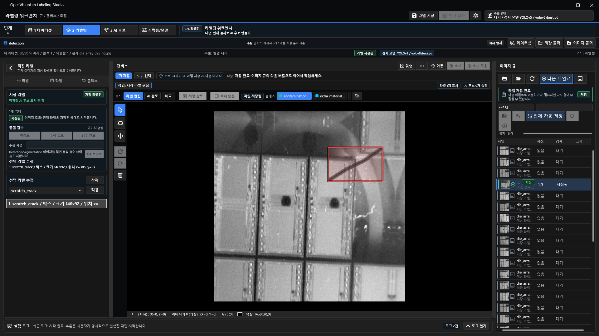
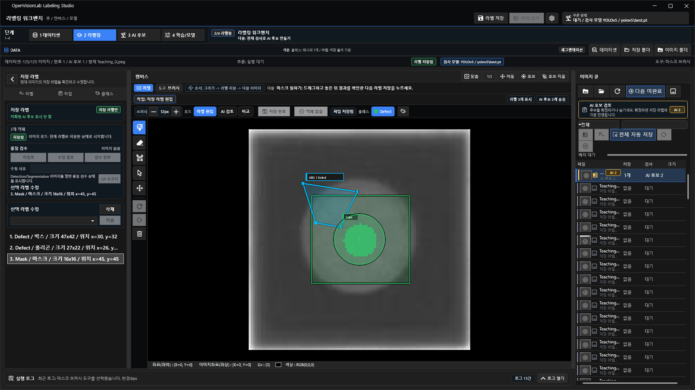
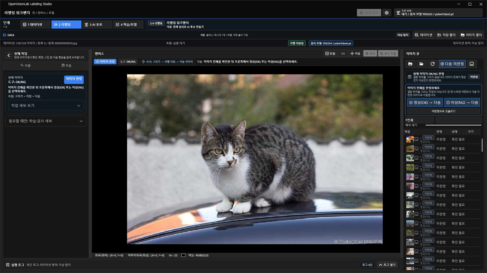
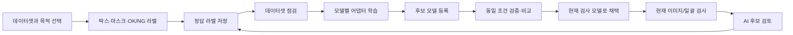

# OpenVisionLab Labeling Studio

산업용 이미지 데이터셋을 만들고, 라벨링하고, 여러 모델로 학습·검증·비교하는 Windows 데스크톱 작업대입니다.



위 화면은 결함이 없는 이미지에 임의 도형을 그린 예가 아닙니다. 눈에 보이는 대각선 `scratch_crack` 결함을 원본 정답 좌표대로 박스로 다시 연 화면입니다.

## 1분 요약

OpenVisionLab Labeling Studio는 라벨만 그리는 도구가 아닙니다. 한 레시피에서 이미지, 클래스, 정답 라벨, 데이터 분할과 검증 근거를 관리하고, 선택한 모델 어댑터가 같은 정답 데이터를 각 학습 형식으로 변환합니다.

- 객체탐지: 대상 위치를 박스로 표시합니다.
- 세그멘테이션: 대상 경계를 폴리곤이나 픽셀 마스크로 표시합니다.
- 이상탐지: 이미지 전체를 정상(OK) 또는 이상(NG)으로 판정합니다.
- 학습·검사: 학습 결과를 후보 모델로 등록하고 검증한 뒤 현재 검사 모델로 채택합니다.
- 모델 비교: 같은 데이터와 조건을 사용한 실행만 비교하고, 조건이 다르면 우열 대신 차이를 표시합니다.

핵심 원칙은 **라벨링 데이터 하나를 모델마다 다시 만들지 않는 것**입니다. 레시피의 정답 데이터는 그대로 두고 YOLOv5, YOLOv8, YOLO11, U-Net 등 연결된 어댑터가 필요한 입력 형식을 만듭니다.

## 바로 시작하기

1. `1 데이터셋`에서 새 데이터셋을 만들고 목적을 선택합니다.
2. 원본 `이미지 폴더`와 결과를 기록할 `저장 폴더`를 각각 지정합니다.
3. `2 라벨링`에서 목적에 맞게 박스, 마스크 또는 OK/NG 판정을 저장합니다.
4. `4 학습/모델`에서 데이터셋 점검을 통과한 뒤 모델과 학습 설정을 선택합니다.
5. 학습된 모델을 바로 교체하지 말고 후보 검증과 비교를 거쳐 `현재 검사 모델`로 저장합니다.

처음 사용하는 경우 [단계별 사용 가이드](docs/tutorial/README.md)를 먼저 보세요.

## 세 가지 라벨링 방식

### 객체탐지

대상의 위치와 종류가 필요할 때 사용합니다. 캔버스에서 실제 결함이 들어가는 최소 영역을 박스로 그리고 클래스를 지정한 뒤 `라벨 저장`을 누릅니다. 아래 예시는 눈에 보이는 대각선 스크래치 하나에만 `scratch_crack` 박스를 표시합니다. 대상이 없는 이미지는 `객체 없음`으로 명시합니다.


### 세그멘테이션

결함이나 부품의 실제 경계가 필요할 때 사용합니다. 폴리곤, 브러시, 지우개로 영역을 만들고 객체 목록과 캔버스에서 결과를 함께 확인합니다. 아래 예시는 객체탐지 화면과 같은 스크래치의 가느다란 경계를 10점 폴리곤으로 따라간 결과입니다.



### 이상탐지

이미지 전체가 정상인지 이상인지 먼저 분류할 때 사용합니다. 박스나 마스크는 필수가 아닙니다. `정상(OK) → 다음` 또는 `이상(NG) → 다음`을 누르면 판정이 저장되고 다음 미판정 이미지로 이동합니다.



현재 이상탐지 학습 경로는 OK와 NG 예시를 모두 사용하는 2클래스 지도학습 분류입니다. 정상 이미지만 학습하는 PatchCore 계열 one-class 방식이나 이상 위치 heatmap과는 다릅니다.

## 하나의 레시피로 여러 모델 사용하기

레시피가 관리하는 공통 근거는 다음과 같습니다.

| 공통 근거 | 역할 |
| --- | --- |
| 원본 이미지 | 모든 어댑터가 공유하는 입력 |
| 클래스 목록과 순서 | 모델 출력과 정답의 의미를 고정 |
| 정답 라벨 | 박스, 폴리곤/마스크 또는 이미지 단위 OK/NG |
| train/valid/test 분할 | 모델 간 비교 조건을 고정 |
| provenance와 지문 | 어떤 데이터·설정·가중치로 실행했는지 추적 |

현재 대표 연결 흐름은 다음과 같습니다.

| 작업 | 학습·비교 대상 |
| --- | --- |
| 객체탐지 | YOLOv5, YOLOv8, YOLO11 |
| 세그멘테이션 | YOLOv8-seg, YOLO11-seg, U-Net |
| 이상탐지 | YOLOv8 classification |

모델 프로필을 선택하면 등록된 로컬 실행기 기준으로 Python, 프로젝트, 실행 스크립트가 함께 전환됩니다. 자동 탐색이 실패한 첫 연결에서만 실행기 폴더를 지정합니다. GitHub의 임의 모델을 이름만으로 자동 지원하지는 않으며, 클래스·분할·출력 매핑과 focused 검증을 갖춘 어댑터만 실행 대상으로 노출합니다.

## 사용 흐름



화면에서 `저장 라벨`, `AI 후보`, `학습 모델 후보`, `현재 검사 모델`은 서로 다른 상태입니다. 모델이 결과를 찾았거나 학습이 끝났다는 사실만으로 정답 라벨이나 현재 검사 모델이 자동 변경되지는 않습니다.

## 설치

필수 조건:

- Windows 10/11 x64
- .NET 8 SDK
- PowerShell
- 학습 또는 추론에 사용할 모델별 Python 런타임과 가중치

저장소를 복제한 뒤 아래 실행 절차를 사용합니다. 개인 PC의 모델 경로는 저장소에 커밋하지 않고 `config/labeling-runtime.local.json`에서 관리합니다.

## 실행

Debug 실행:

```powershell
dotnet build .\OpenVisionLab.LabelingStudio.sln -c Debug -p:Platform=x64
.\scripts\start-labeling-workbench.ps1 -AppMode Debug
```

Release publish 실행:

```powershell
.\scripts\publish-win-x64.ps1 -Configuration Release
.\scripts\start-labeling-workbench.ps1 -AppMode Publish
```

## 샘플 데이터

| 위치 | 용도 |
| --- | --- |
| `datasets/object-detection/coco128/coco128/README.txt` | 객체탐지 샘플 데이터 안내 |
| `samples/python_protocol/README.md` | Python TCP 프로토콜과 mock client 예제 |
| `docs/tutorial/images` | README와 튜토리얼 화면 캡처 |

원본 이미지 폴더와 저장 폴더는 분리하세요. 같은 이미지를 다른 모델로 실험할 때도 정답을 복사해 수정하지 말고, 같은 레시피와 분할을 모델 어댑터가 재사용하게 합니다.

## Build Command

일반 개발 빌드:

```powershell
dotnet build .\OpenVisionLab.LabelingStudio.sln -c Debug -p:Platform=x64
```

격리 테스트 빌드:

```powershell
dotnet build .\tests\LabelingApplication.Tests\LabelingApplication.Tests.csproj -c Debug /nr:false -m:1 /p:UseSharedCompilation=false /p:OutDir=artifacts\isolated-out\
```

## Smoke Command

첫 실행과 WPF 기본 흐름:

```powershell
.\scripts\verify-first-run.ps1
.\scripts\verify-first-run.ps1 -RunWpfSmoke
```

공개 문서와 주요 워크플로 계약:

```powershell
dotnet .\tests\LabelingApplication.Tests\artifacts\isolated-out\LabelingApplication.Tests.dll --priority-workflow-docs
```

## CI

GitHub Actions의 `.github/workflows/ci.yml`은 다음을 확인합니다.

- README 필수 섹션
- .NET 테스트 프로젝트 빌드
- `--priority-workflow-docs` smoke
- `git diff --check`

## 문서

| 문서 | 내용 |
| --- | --- |
| [단계별 사용 가이드](docs/tutorial/README.md) | 객체탐지·세그멘테이션·이상탐지 라벨링과 학습 절차 |
| [화면 캡처 튜토리얼](docs/tutorial/labeling-workbench-tutorial.html) | 번호가 표시된 전체 화면 안내 |
| [YOLOv5 학습 결과 판단 기준](docs/YOLOV5_TRAINING_RESULT_WORKFLOW.md) | 학습 완료 후 후보를 채택하기 전 확인할 기준 |
| [세그멘테이션 UX 기준](docs/SEGMENTATION_UX_COMPLETION.md) | 마스크·폴리곤 저장과 검증 기준 |
| [이상탐지 흐름](docs/ANOMALY_DETECTION_FLOW.md) | OK/NG 판정, 분류 학습, 검증 절차 |
| [모델 비교 기록](docs/YOLO11_ENGINE_COMPARISON_20260721.md) | 모델별 비교 계약과 근거 |
| [합성 데이터 검증 계약](docs/SYNTHETIC_EVIDENCE_CONTRACT.md) | 합성 데이터로 기능을 완료하는 기준과 현장 성능 경계 |

## Release Notes

사용자에게 영향을 주는 변경은 [RELEASE_NOTES.md](RELEASE_NOTES.md)에 기록합니다. 상세 개발 검증 이력은 `docs/WORK_TRACKING.md`에서 관리합니다.

## Roadmap

1. 희소 전경 결함에서 U-Net 클래스 분리 성능을 높이고 동일 마스크 기준으로 YOLO segmentation과 재비교합니다.
2. 독립 생산 카메라·다른 세션 데이터로 객체탐지와 이상분류의 일반화 성능을 검증합니다.
3. 모델 어댑터를 추가할 때 공통 레시피, 원본 불변성, 동일 split, 결과 provenance 계약을 유지합니다.

## Known Limitations

- 현재 이상탐지는 OK/NG 2클래스 분류이며 one-class novelty detection이나 위치 heatmap 학습이 아닙니다.
- 합성 데이터는 기능·어댑터·재현성 완료 근거로 사용할 수 있지만 생산 정확도 보장은 아닙니다. 현장 데이터가 없으면 `현장 검증 미평가`로 분리합니다.
- 모델 비교는 같은 데이터 지문, 클래스, split과 평가 조건이 확인될 때만 의미가 있습니다.
- 로컬 Python 모델 런타임과 시작 가중치는 별도 준비가 필요할 수 있으며 승인 없이 자동 다운로드하지 않습니다.
- 클라우드 계정, 팀 협업 권한, 배포 파이프라인, 카메라·PLC 제어는 현재 제품 범위가 아닙니다.

## 라이선스

이 프로젝트는 [MIT License](LICENSE)로 배포합니다. 소프트웨어를 복사하거나 배포할 때 [LICENSE](LICENSE)와 [NOTICE](NOTICE)의 저작권·라이선스 고지를 유지해야 합니다.

Copyright (c) 2026 최노아 (Noah-Choi)
