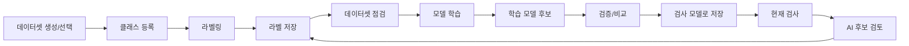

# OpenVisionLab Labeling Studio

산업용 비전 검사 데이터를 라벨링하고, 학습하고, 학습된 모델로 다시 검사해보는 Windows 기반 작업 프로그램입니다.

화면은 이미지에 박스를 그리는 일에서 시작하지만, 여기서 끝나면 실제 검사 업무에는 부족합니다.

현장에서 필요한 흐름은 `라벨링` 하나로 끝나지 않습니다. 데이터셋을 만들고, 저장 위치를 관리하고, 라벨을 검토하고, 모델을 학습하고, 새 모델이 기존 모델보다 나은지 확인한 뒤, 실제 검사 모델로 적용해야 합니다.

이 프로젝트는 그 흐름을 한 화면 안에서 끊기지 않게 이어가도록 만들고 있습니다.


데이터셋 만들기, 이미지 큐 확인, 클래스 설정, 라벨링, 학습 결과 확인, 현재 검사 실행까지 이어지는 과정은 [docs/tutorial/README.md](docs/tutorial/README.md)에 정리했습니다.

## 처음 실행할 때 보는 순서

앱을 처음 열면 아래 순서만 따라가면 됩니다.

1. 상단 작업 흐름에서 `1 데이터셋`을 선택합니다.
2. 왼쪽 작업 패널에서 새 데이터셋을 만들거나 기존 데이터셋을 엽니다.
3. 오른쪽 이미지 큐에서 작업할 이미지와 저장 상태를 확인합니다.
4. 가운데 캔버스에서 라벨을 그리고 `라벨 저장`을 누릅니다.
5. `4 학습/모델`에서 학습 결과와 현재 검사 모델을 구분해서 확인합니다.

화면을 보며 따라가려면 [화면 캡처 중심 튜토리얼](docs/tutorial/labeling-workbench-tutorial.html)을 먼저 여는 것이 가장 빠릅니다.
HTML 하나만 옮겨서 볼 때는 [이미지 포함 단독 튜토리얼](docs/tutorial/labeling-workbench-tutorial-standalone.html)을 사용합니다.

## 프로젝트 방향

OpenVisionLab Labeling Studio는 `라벨링 툴`이라기보다 `검사 모델을 만들기 위한 작업대`에 가깝습니다.

프로젝트에서 중요하게 잡은 기준은 세 가지입니다.

1. 라벨링을 처음 하는 사람도 지금 무엇을 해야 하는지 알 수 있어야 합니다.
2. 라벨과 AI 추론 후보가 섞여 보이면 안 됩니다. 정답 데이터와 모델 제안은 분리해서 보여야 합니다.
3. 학습이 끝났다는 사실과, 그 모델을 실제 검사 모델로 쓴다는 결정은 분리되어야 합니다.

그래서 앱은 데이터셋, 라벨, AI 후보, 학습 모델 후보, 현재 검사 모델을 각각 다른 상태로 보여줍니다.

## 현재 가능한 작업

| 영역 | 현재 상태 |
| --- | --- |
| 객체탐지 라벨링 | 박스 라벨 생성, 클래스 관리, YOLO txt 저장, 저장 상태 표시 |
| 세그멘테이션 | polygon, brush, eraser 기반 mask/polygon 라벨링 흐름 |
| 이상탐지 | 이미지 단위 정상/불량 흐름을 설계 중입니다. 아직 완료 기능으로 표시하지 않습니다. |
| 데이터셋 관리 | 이미지 폴더와 저장 폴더를 분리하고, 데이터셋 단위로 클래스/라벨/학습 파일을 관리 |
| 템플릿 보조 라벨링 | 기준 라벨과 비슷한 위치를 찾아 현재 이미지 또는 전체 이미지 큐에 후보 생성 |
| YOLOv5 학습 | 데이터셋 점검, train/valid/test 분할, Python worker 학습 실행과 상태 수신 |
| 추론 검토 | AI 후보를 확인하고, 맞는 후보만 저장 라벨로 확정 |
| 모델 관리 | 학습된 `best.pt` 후보 등록, 현재 검사 모델 적용, 모델 이력과 비교 흐름 |

현재 학습 어댑터는 YOLOv5 중심입니다. 다만 프로그램의 구조는 YOLO 전용 툴로 고정하지 않고, 이후 다른 모델 프로필도 같은 흐름에서 비교하고 적용할 수 있는 방향으로 잡고 있습니다.

## 사용 흐름



처음 사용하는 경우에는 아래 순서로 보면 됩니다.

1. `1 데이터셋`에서 새 데이터셋을 만들거나 기존 데이터셋을 엽니다.
2. 이미지 폴더와 저장 폴더가 맞는지 확인합니다.
3. 클래스를 등록합니다.
4. `2 라벨링`에서 박스를 그리고 `라벨 저장`을 누릅니다.
5. `3 추론 검토`에서 현재 검사 모델의 AI 후보를 확인합니다.
6. `4 학습/모델`에서 데이터셋 점검, 학습, 후보 검증, 검사 모델 적용을 진행합니다.

자세한 작업 가이드는 [docs/tutorial/README.md](docs/tutorial/README.md)에 정리했습니다.

브라우저에서 화면을 크게 보려면 [docs/tutorial/labeling-workbench-tutorial.html](docs/tutorial/labeling-workbench-tutorial.html)을 열면 됩니다.

HTML 파일 하나만 다른 PC에 복사해서 보려면 이미지가 포함된 [docs/tutorial/labeling-workbench-tutorial-standalone.html](docs/tutorial/labeling-workbench-tutorial-standalone.html)을 사용합니다.

## 화면에서 꼭 구분해야 하는 것

| 화면 표시 | 의미 |
| --- | --- |
| `저장 필요` | 현재 이미지의 라벨이 바뀌었지만 아직 파일에 저장되지 않은 상태 |
| `저장됨` | 라벨 파일에 반영된 상태 |
| `저장 라벨` | 학습 데이터로 들어가는 실제 라벨 |
| `AI 후보` | 모델이 제안한 결과. 확정 전에는 정답 라벨이 아님 |
| `학습 모델 후보` | 학습은 끝났지만 아직 검사 모델로 확정하지 않은 weight |
| `현재 검사 모델` | 지금 `현재 검사` 버튼이 사용하는 모델 |

이 구분이 중요한 이유는 실제 사용 중 가장 많이 헷갈리는 지점이기 때문입니다.

모델이 박스를 찾았다고 해서 라벨링이 끝난 것이 아니고, 학습이 끝났다고 해서 그 모델로 검사 중인 것도 아닙니다.

## 프로젝트의 핵심 흐름

이 프로젝트에서 가장 신경 쓴 부분은 기능 개수보다 작업 흐름입니다.

- 데이터셋 저장 폴더와 이미지 폴더를 분리해, 같은 이미지로 여러 실험을 만들 수 있게 했습니다.
- 라벨 편집 상태를 `저장 필요`와 `저장됨`으로 명확히 보여줍니다.
- 저장 라벨과 AI 후보를 캔버스 표시 모드와 작업 패널에서 분리했습니다.
- 학습 완료 모델을 바로 적용하지 않고, 후보 검증과 현재 검사 모델 적용 단계를 분리했습니다.
- 자주 쓰는 라벨링 화면은 넓게 쓰고, 설정/도구/모델 관리는 필요한 단계에서만 보이도록 UI를 정리하고 있습니다.
- 화면 구조는 작업 흐름이 먼저 보이도록 정리하고, 자주 쓰지 않는 설정은 필요한 단계에서만 드러나게 하고 있습니다.

## 실행

모델 런타임 경로는 설치 환경에 맞게 연결합니다. 절대 경로가 필요한 설정은 로컬 설정 파일로 분리합니다.

Debug 실행:

```powershell
dotnet build .\OpenVisionLab.LabelingStudio.sln -c Debug -p:Platform=x64
.\scripts\start-labeling-workbench.ps1 -AppMode Debug
```

Release publish 실행:

```powershell
.\scripts\publish-win-x64.ps1 -Configuration Release
.\scripts\start-labeling-workbench.ps1 -AppMode Publish
```

첫 실행 검증:

```powershell
.\scripts\verify-first-run.ps1
.\scripts\verify-first-run.ps1 -RunWpfSmoke
```

로컬 경로 설정이 필요하면 `config\labeling-runtime.local.json`을 사용합니다.

## 추가 가이드

| 문서 | 내용 |
| --- | --- |
| [사용 가이드](docs/tutorial/README.md) | 데이터셋 준비부터 라벨링, 학습, 추론 검토까지 따라가는 작업 흐름 |
| [화면 캡처 튜토리얼](docs/tutorial/labeling-workbench-tutorial.html) | 실제 화면을 보며 따라가는 튜토리얼 |
| [YOLOv5 학습 결과 판단 기준](docs/YOLOV5_TRAINING_RESULT_WORKFLOW.md) | 학습 완료 후 모델 후보를 현재 검사 모델로 적용하기 전 확인할 기준 |
| [세그멘테이션 UX 기준](docs/SEGMENTATION_UX_COMPLETION.md) | 세그멘테이션 라벨링 흐름과 완료 기준 |
| [이상탐지 흐름](docs/ANOMALY_DETECTION_FLOW.md) | 이상탐지 데이터셋과 검토 흐름 |

## 라이선스와 저작권 고지

이 프로젝트는 [MIT License](LICENSE)로 배포합니다.

상업적 사용, 수정, 배포가 가능합니다. 단, 소프트웨어를 복사하거나 배포할 때는 저작권 고지와 라이선스 고지를 함께 유지해야 합니다.

다음 고지는 제거하지 마세요.

- [LICENSE](LICENSE)
- [NOTICE](NOTICE)
- 프로젝트 파일과 패키지 메타데이터에 남아 있는 저작권 고지

Copyright (c) 2026 최노아 (Noah-Choi)
