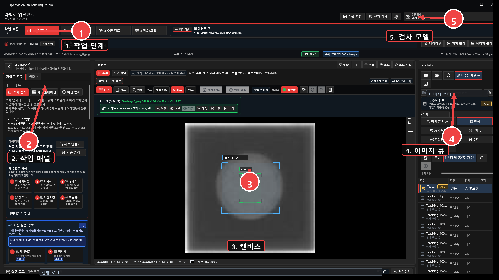
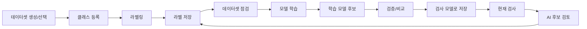

# OpenVisionLab Labeling Studio

산업용 비전 검사 데이터를 라벨링하고, 학습하고, 학습된 모델로 다시 검사해보는 Windows 기반 작업 프로그램입니다.



데이터셋 만들기, 이미지 큐 확인, 클래스 설정, 라벨링, 학습 결과 확인, 현재 검사 실행까지 이어지는 과정은 [docs/tutorial/README.md](docs/tutorial/README.md)에 정리했습니다.

## 1분 요약

OpenVisionLab Labeling Studio는 단순히 라벨 파일만 만드는 도구가 아니라, 로컬 Windows 환경에서 산업용 이미지 데이터셋을 준비하고 YOLO 계열 모델을 학습/검토/적용하는 작업대입니다.

- `저장 라벨`과 `AI 후보`를 분리해서 봅니다.
- 학습이 끝난 `모델 후보`와 실제 검사에 쓰는 `현재 검사 모델`을 분리합니다.
- 객체탐지, 세그멘테이션, 이상탐지 목적을 같은 워크플로우 안에서 다룹니다.
- 현재 제품 우선순위는 로컬 산업용 세그멘테이션/이상탐지 운영 품질입니다.

## 처음 실행할 때 보는 순서

앱을 처음 열면 아래 순서만 따라가면 됩니다.

1. 상단 작업 흐름에서 `1 데이터셋`을 선택합니다.
2. 왼쪽 작업 패널에서 새 데이터셋을 만들거나 기존 데이터셋을 엽니다.
3. 오른쪽 이미지 큐에서 작업할 이미지와 저장 상태를 확인합니다.
4. 가운데 캔버스에서 라벨을 그리고 `라벨 저장`을 누릅니다.
5. `4 학습/모델`에서 학습 결과와 현재 검사 모델을 구분해서 확인합니다.

화면을 보며 따라가려면 [화면 캡처 중심 튜토리얼](docs/tutorial/labeling-workbench-tutorial.html)을 먼저 여는 것이 가장 빠릅니다.
HTML 하나만 옮겨서 볼 때는 [이미지 포함 단독 튜토리얼](docs/tutorial/labeling-workbench-tutorial-standalone.html)을 사용합니다.

## 설치

필수 조건:

- Windows
- .NET 8 SDK
- PowerShell
- 로컬 모델 학습/추론을 쓸 경우 별도 Python YOLO 런타임

모델 런타임 경로는 설치 환경에 맞게 앱에서 연결합니다. 절대 경로가 필요한 설정은 커밋하지 않는 로컬 설정 파일인 `config\labeling-runtime.local.json`로 분리합니다.

## 실행

Debug 실행:

```powershell
dotnet build .\OpenVisionLab.LabelingStudio.sln -c Debug -p:Platform=x64
.\scripts\start-labeling-workbench.ps1 -AppMode Debug
```

Release publish 실행:

```powershell
.\scripts\publish-win-x64.ps1 -Configuration Release
.\scripts\start-labeling-workbench.ps1 -AppMode Publish
```

## 샘플 데이터

현재 저장소에는 아래 샘플/가이드가 있습니다.

| 위치 | 용도 |
| --- | --- |
| `datasets/object-detection/coco128/coco128/README.txt` | 객체탐지 샘플 데이터 안내 |
| `samples/python_protocol/README.md` | Python TCP 프로토콜과 mock client 샘플 |
| `docs/tutorial/images` | README와 튜토리얼에 쓰는 화면 캡처 |

앱에서 새 데이터셋을 만들 때는 이미지 폴더와 라벨 저장 폴더를 분리해서 선택합니다. 같은 이미지로 여러 실험을 할 때도 저장 폴더를 분리해야 이전 라벨과 섞이지 않습니다.

## Build Command

일반 개발 빌드:

```powershell
dotnet build .\OpenVisionLab.LabelingStudio.sln -c Debug -p:Platform=x64
```

테스트 프로젝트 기준 격리 빌드:

```powershell
dotnet build .\tests\LabelingApplication.Tests\LabelingApplication.Tests.csproj -c Debug /nr:false -m:1 /p:UseSharedCompilation=false /p:OutDir=artifacts\isolated-out\
```

## Smoke Command

첫 실행 검증:

```powershell
.\scripts\verify-first-run.ps1
.\scripts\verify-first-run.ps1 -RunWpfSmoke
```

문서/우선순위 계약 검증:

```powershell
dotnet .\tests\LabelingApplication.Tests\artifacts\isolated-out\LabelingApplication.Tests.dll --priority-workflow-docs
```

WPF 셸 생성 smoke:

```powershell
dotnet .\tests\LabelingApplication.Tests\artifacts\isolated-out\LabelingApplication.Tests.dll --wpf-labeling-shell
```

수동 화면 점검 순서는 [docs/WPF_MANUAL_SMOKE_CHECKLIST.md](docs/WPF_MANUAL_SMOKE_CHECKLIST.md)를 봅니다.

## CI

GitHub Actions workflow는 `.github/workflows/ci.yml`에 있습니다.

현재 CI는 다음만 자동 확인합니다.

- README 필수 섹션 존재
- 릴리즈 노트 파일 존재
- .NET 테스트 프로젝트 빌드
- `--priority-workflow-docs` smoke
- `git diff --check` 공백 검사

`Library-Noah`는 소스 프로젝트 참조가 아니라 repo의 `dll` 폴더에 있는 `Lib.Common.dll`과 `Lib.OpenCV.dll` 바이너리 참조로 고정합니다.

## Release Notes

릴리즈 노트는 [RELEASE_NOTES.md](RELEASE_NOTES.md)에 기록합니다.

작업 중 상세 검증 이력은 [docs/WORK_TRACKING.md](docs/WORK_TRACKING.md)에 남기고, 사용자에게 의미 있는 변경만 릴리즈 노트로 승격합니다.

## Roadmap

현재 로컬 산업용 워크스테이션 기준 우선순위:

1. YOLOv8 세그멘테이션 학습/추론/모델 비교 운영 품질 강화
2. 이상탐지 image-level 분류 학습/추론 smoke 보강
3. 데이터셋 품질 감사와 리포트 저장 UX 보강
4. 샘플 데이터와 튜토리얼을 실제 신규 사용자 기준으로 정리

자세한 자체평가와 다음 개발 추천은 [docs/LABELING_STUDIO_COMPLETENESS_AUDIT.md](docs/LABELING_STUDIO_COMPLETENESS_AUDIT.md)를 봅니다.

## Known Limitations

- 클라우드 라벨링 플랫폼이나 팀 협업 제품이 아닙니다.
- 현재 방향은 로컬 단일 작업자용 산업 이미지 워크플로우입니다.
- YOLOv8 세그멘테이션 런타임 경로는 연결되어 있지만, 생산 정확도는 별도 held-out 평가가 필요합니다.
- 이상탐지는 목적/상태/학습 흐름이 진행 중이며, 완료 제품으로 보지 않습니다.
- `Lib.Common.dll`과 `Lib.OpenCV.dll`을 갱신할 때는 `dll` 폴더의 바이너리와 빌드 검증을 같이 갱신해야 합니다.
- Viewer/OpenGL/ROI/brush/eraser 성능 경로는 검증된 hot path라 재현 없이 구조 변경하지 않습니다.

## 현재 가능한 작업

| 영역 | 현재 상태 |
| --- | --- |
| 객체탐지 라벨링 | 박스 라벨 생성, 클래스 관리, YOLO txt 저장, 저장 상태 표시 |
| 세그멘테이션 | polygon, brush, eraser 기반 mask/polygon 라벨링 흐름 |
| 이상탐지 | 이미지 단위 정상/불량 흐름과 분류 학습 경로를 보강 중 |
| 데이터셋 관리 | 이미지 폴더와 저장 폴더를 분리하고, 데이터셋 단위로 클래스/라벨/학습 파일을 관리 |
| 템플릿 보조 라벨링 | 기준 라벨과 비슷한 위치를 찾아 현재 이미지 또는 전체 이미지 큐에 후보 생성 |
| YOLO 학습 | 데이터셋 점검, train/valid/test 분할, Python worker 학습 실행과 상태 수신 |
| AI 후보 검토 | AI 후보를 확인하고, 맞는 후보만 저장 라벨로 확정 |
| 모델 관리 | 학습된 `best.pt` 후보 등록, 현재 검사 모델 적용, 모델 이력과 비교 흐름 |

## 사용 흐름



자세한 작업 가이드는 [docs/tutorial/README.md](docs/tutorial/README.md)에 정리했습니다.

## 화면에서 꼭 구분해야 하는 것

| 화면 표시 | 의미 |
| --- | --- |
| `저장 필요` | 현재 이미지의 라벨이 바뀌었지만 아직 파일에 저장되지 않은 상태 |
| `저장됨` | 라벨 파일에 반영된 상태 |
| `저장 라벨` | 학습 데이터로 들어가는 실제 라벨 |
| `AI 후보` | 모델이 제안한 결과. 확정 전에는 정답 라벨이 아님 |
| `학습 모델 후보` | 학습은 끝났지만 아직 검사 모델로 확정하지 않은 weight |
| `현재 검사 모델` | 지금 `현재 검사` 버튼이 사용하는 모델 |

모델이 박스를 찾았다고 해서 라벨링이 끝난 것이 아니고, 학습이 끝났다고 해서 그 모델로 검사 중인 것도 아닙니다.

## 추가 가이드

| 문서 | 내용 |
| --- | --- |
| [사용 가이드](docs/tutorial/README.md) | 데이터셋 준비부터 라벨링, 학습, AI 후보 검토까지 따라가는 작업 흐름 |
| [화면 캡처 튜토리얼](docs/tutorial/labeling-workbench-tutorial.html) | 실제 화면을 보며 따라가는 튜토리얼 |
| [YOLOv5 학습 결과 판단 기준](docs/YOLOV5_TRAINING_RESULT_WORKFLOW.md) | 학습 완료 후 모델 후보를 현재 검사 모델로 적용하기 전 확인할 기준 |
| [세그멘테이션 UX 기준](docs/SEGMENTATION_UX_COMPLETION.md) | 세그멘테이션 라벨링 흐름과 완료 기준 |
| [이상탐지 흐름](docs/ANOMALY_DETECTION_FLOW.md) | 이상탐지 데이터셋과 검토 흐름 |

## 라이선스와 저작권 고지

이 프로젝트는 [MIT License](LICENSE)로 배포합니다.

상업적 사용, 수정, 배포가 가능합니다. 단, 소프트웨어를 복사하거나 배포할 때는 저작권 고지와 라이선스 고지를 함께 유지해야 합니다.

다음 고지는 제거하지 마세요.

- [LICENSE](LICENSE)
- [NOTICE](NOTICE)
- 프로젝트 파일과 패키지 메타데이터에 남아 있는 저작권 고지

Copyright (c) 2026 최노아 (Noah-Choi)
