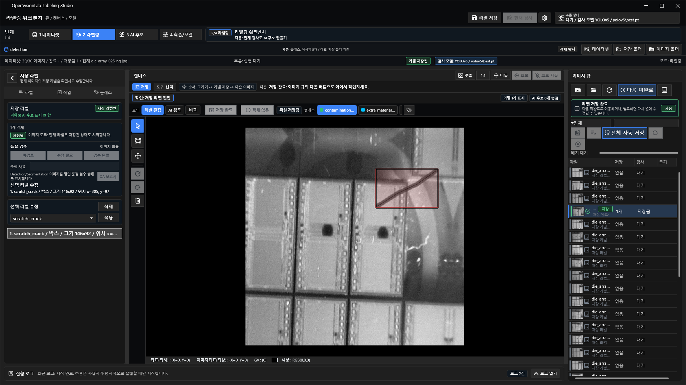
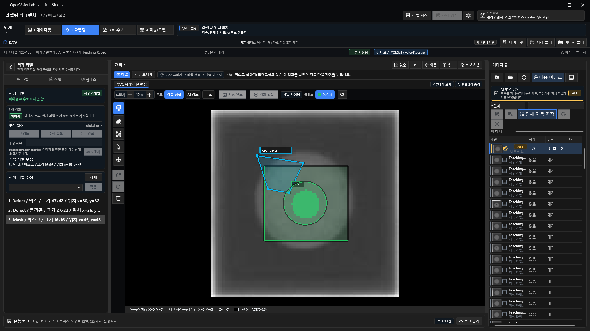
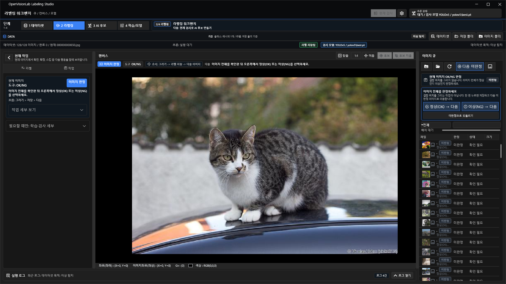
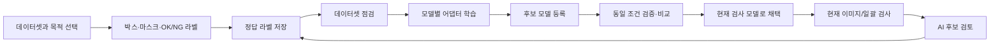

# OpenVisionLab Labeling Studio

산업용 이미지 데이터셋을 만들고, 라벨링하고, 여러 모델로 학습·검증·비교하는 Windows 데스크톱 작업대입니다.


> 최신 Windows EXE를 직접 조작해 녹화한 약 6.5초 화면입니다. 실제 패널 전환과 후보 검토 중에도 뷰어의 이미지 위치와 배율이 유지되며, 결함 박스 입력부터 MobileSAM 후보 확인, 명시적 확정과 저장까지 보여 줍니다. [실제 EXE 정지 이미지 보기](docs/tutorial/images/github/labeling-smart-mask-stable-20260805-poster.png)



위 화면은 결함이 없는 이미지에 임의 도형을 그린 예가 아닙니다. 눈에 보이는 대각선 `scratch_crack` 결함을 원본 정답 좌표대로 박스로 다시 연 화면입니다.

## 1분 요약

OpenVisionLab Labeling Studio는 라벨만 그리는 도구가 아닙니다. 한 레시피에서 이미지, 클래스, 정답 라벨, 데이터 분할과 검증 근거를 관리하고, 선택한 모델 어댑터가 같은 정답 데이터를 각 학습 형식으로 변환합니다.

- 객체탐지: 대상 위치를 박스로 표시합니다.
- 세그멘테이션: 대상 경계를 폴리곤이나 픽셀 마스크로 표시합니다.
- 이상탐지: 이미지 전체를 정상(OK) 또는 이상(NG)으로 판정합니다.
- 학습·검사: 학습 결과를 후보 모델로 등록하고 검증한 뒤 현재 검사 모델로 채택합니다.
- 모델 비교: 같은 데이터와 조건을 사용한 실행만 비교하고, 조건이 다르면 우열 대신 차이를 표시합니다.

핵심 원칙은 **라벨링 데이터 하나를 모델마다 다시 만들지 않는 것**입니다. 레시피의 정답 데이터는 그대로 두고 YOLOv5, YOLOv8, YOLO11, U-Net 등 연결된 어댑터가 필요한 입력 형식을 만듭니다.

## 바로 시작하기

1. `1 데이터셋`에서 새 데이터셋을 만들고 목적을 선택합니다.
2. 원본 `이미지 폴더`와 결과를 기록할 `저장 폴더`를 각각 지정합니다.
3. `2 라벨링`에서 목적에 맞게 박스, 마스크 또는 OK/NG 판정을 저장합니다.
4. `4 학습/모델`에서 데이터셋 점검을 통과한 뒤 모델과 학습 설정을 선택합니다.
5. 학습된 모델을 바로 교체하지 말고 후보 검증과 비교를 거쳐 `현재 검사 모델`로 저장합니다.

처음 사용하는 경우 [단계별 사용 가이드](docs/tutorial/README.md)를 먼저 보세요.

Visual Studio에서는 `OpenVisionLab.LabelingStudio.sln`을 열고
`OpenVisionLab.LabelingStudio` 프로젝트를 시작 프로젝트로 선택한 뒤 x64로 빌드합니다.

## 세 가지 라벨링 방식

### 객체탐지

대상의 위치와 종류가 필요할 때 사용합니다. 캔버스에서 실제 결함이 들어가는 최소 영역을 박스로 그리고 클래스를 지정한 뒤 `라벨 저장`을 누릅니다. 아래 예시는 눈에 보이는 대각선 스크래치 하나에만 `scratch_crack` 박스를 표시합니다. 대상이 없는 이미지는 `객체 없음`으로 명시합니다.


### 세그멘테이션

결함이나 부품의 실제 경계가 필요할 때 사용합니다. 폴리곤, 브러시, 지우개로 영역을 만들고 객체 목록과 캔버스에서 결과를 함께 확인합니다. 아래 예시는 객체탐지 화면과 같은 스크래치의 가느다란 경계를 10점 폴리곤으로 따라간 결과입니다.



반복해서 자동 경계를 만들려면 세그멘테이션 Recipe의 `라벨링 옵션`에서
`자동 윤곽`을 한 번 켭니다. 이후 결함을 사각형으로 감쌀 때마다
MobileSAM 후보가 별도 생성 버튼 없이 바로 나타나며, 작업 패널이
펼쳐져도 뷰어 맞춤은 자동으로 갱신됩니다. 후보가 부족하면 `보정 옵션`에서
포함점 또는 제외점을 한 번에 하나씩 추가하고 `후보 다시 생성`을 누른
뒤 `이전 후보 보기`와 `현재 후보 보기`로 비교합니다. 후보 생성과
후보 전환만으로는 파일이 바뀌지 않습니다. 표시 중인 후보가 맞으면
`확정`하여 정답 파일에 저장하고, 틀리면 `스킵`합니다. Recipe를 다시
열면 옵션은 복원되지만 복원 자체가 추론·확정·저장을 실행하지는
않습니다. 전체 작업 순서는 아래 단계별 사용자 매뉴얼에서 확인할 수 있습니다.

### 이상탐지

이미지 전체가 정상인지 이상인지 먼저 분류할 때 사용합니다. 박스나 마스크는 필수가 아닙니다. `정상(OK) → 다음` 또는 `이상(NG) → 다음`을 누르면 판정이 저장되고 다음 미판정 이미지로 이동합니다.



이상탐지는 두 모델 계약을 제공합니다. YOLOv8/YOLO11 분류는 OK와 NG 예시를 모두 사용하는 2클래스 지도학습이며 이미지 전체 판정을 반환합니다. PatchCore bounded pilot은 검토 완료 정상 이미지만 학습하고 이미지 판정, 이상 점수/임계값, 미확정 위치 후보와 heatmap을 반환합니다. 후보 검토의 `히트맵 보기`는 명시적으로 눌렀을 때만 읽기 전용 검토 창을 열며 라벨·후보·모델을 자동 변경하지 않습니다. 위치 후보는 자동 저장되지 않으며 생산 품질은 별도 held-out 검증이 필요합니다.

## 하나의 레시피로 여러 모델 사용하기

레시피가 관리하는 공통 근거는 다음과 같습니다.

| 공통 근거 | 역할 |
| --- | --- |
| 원본 이미지 | 모든 어댑터가 공유하는 입력 |
| 클래스 목록과 순서 | 모델 출력과 정답의 의미를 고정 |
| 정답 라벨 | 박스, 폴리곤/마스크 또는 이미지 단위 OK/NG |
| train/valid/test 분할 | 모델 간 비교 조건을 고정 |
| provenance와 지문 | 어떤 데이터·설정·가중치로 실행했는지 추적 |

Recipe를 저장하거나 학습을 시작하면 이미지·라벨의 실제 내용, 클래스
순서와 train/valid/test 소속을 묶은 `dsv2-...` 데이터 버전이 생성됩니다.
같은 내용은 같은 버전을 재사용하고, 라벨 좌표나 분할이 바뀌면 새
버전이 됩니다. `4 학습/모델` → `데이터` → `프로젝트`에서 현재 버전과
콘텐츠 SHA-256을 확인할 수 있으며, 학습 모델 이력도 사용한 버전을
기록합니다. 원본 데이터 전체를 복사하는 기능은 아닙니다.

현재 대표 연결 흐름은 다음과 같습니다.

| 작업 | 학습·비교 대상 |
| --- | --- |
| 객체탐지 | YOLOv5, YOLOv8, YOLO11 |
| 세그멘테이션 | YOLOv8-seg, YOLO11-seg, U-Net |
| 이상탐지 | YOLOv8/YOLO11 classification, PatchCore pilot |

모델 프로필을 선택하면 등록된 로컬 실행기 기준으로 Python, 프로젝트, 실행 스크립트가 함께 전환됩니다. 자동 탐색이 실패한 첫 연결에서만 실행기 폴더를 지정합니다. GitHub의 임의 모델을 이름만으로 자동 지원하지는 않으며, 클래스·분할·출력 매핑과 focused 검증을 갖춘 어댑터만 실행 대상으로 노출합니다.

## 사용 흐름


```mermaid
flowchart LR
    Dataset["데이터셋과 목적 선택"] --> Label["박스·마스크·OK/NG 라벨"]
    Label --> Save["정답 라벨 저장"]
    Save --> Health["데이터셋 점검"]
    Health --> Train["모델별 어댑터 학습"]
    Train --> Candidate["후보 모델 등록"]
    Candidate --> Compare["동일 조건 검증·비교"]
    Compare --> Adopt["현재 검사 모델로 채택"]
    Adopt --> Infer["현재 이미지/일괄 검사"]
    Infer --> Review["AI 후보 검토"]
    Review --> Save
```

화면에서 `저장 라벨`, `AI 후보`, `학습 모델 후보`, `현재 검사 모델`은 서로 다른 상태입니다. 모델이 결과를 찾았거나 학습이 끝났다는 사실만으로 정답 라벨이나 현재 검사 모델이 자동 변경되지는 않습니다.

## 버전 관리

제품 버전의 단일 기준은 저장소 루트 `Directory.Build.props`의
`VersionPrefix`입니다. 이 값에서 제품 버전, 어셈블리/파일 버전, self-contained
패키지 폴더, release manifest, CI artifact 이름을 일관되게 생성하고,
사용자에게 영향을 주는 변경은 `RELEASE_NOTES.md`에 기록합니다. 이 저장소는
실제 검증된 변경을 버전별 checkpoint로 계속 갱신합니다.

- 현재 소스 버전: `0.3.4` (2026-09-15)
- 이전 Public 버전: `0.3.3`
- 최근 버전 기록:
  - `0.3.4` (2026-09-15): WPF Shell의 수동 partial 분산 책임을 기능별
    View·ViewModel·adapter·lifecycle owner로 정리하고 저장·검수·학습 작업 흐름을
    보존했습니다. annotation·Recipe·Dataset Version·model-state 공개 형식은 유지됩니다.
  - `0.3.3` (2026-09-08): 전수조사 결과를 기준으로 WPF Shell·Canvas·Queue·Model
    책임을 concrete owner로 정리하고, PL-0042~0060의 호출 경로·상태 소유·문서
    중복 방지 경계를 기록했습니다. 저장 포맷과 모델 상태 경계는 변경하지 않았습니다.
  - `0.3.2` (2026-09-07): Shell partial과 내부 WPF 계약의 책임을 concrete owner로
    정리하고 비동기 종료·수명 경계를 보강했습니다. 저장 포맷과 모델 상태 경계는
    변경하지 않았습니다.
  - `0.3.1` (2026-09-04): Shell partial 책임을 concrete owner로 이동하고
    명령·콜백의 종료 경계를 보강했습니다. 저장 포맷과 모델 상태 경계는
    변경하지 않았습니다.
  - `0.3.0` (2026-08-31): 통합 Studio workflow와 WPF review owner 구조를
    정리하고 저장·검수 동작을 보존했습니다.
  - `0.2.1` (2026-08-25): 최소 WPF workspace와 기존 annotation 동작을
    호환 가능한 PATCH 후보로 정리했습니다.
  - `0.2.0` (2026-08-24): bounded WPF presentation과 localization 후보를
    Public source에 반영했습니다.
- 일반 커밋은 버전을 올리지 않으며, 호환 가능한 버그 수정은 PATCH, 호환 가능한
  기능 추가는 MINOR, 호환성을 깨는 변경은 MAJOR로 관리합니다.
- 이미 공개된 버전의 내용은 수정하지 않고 다음 버전으로 기록합니다. GitHub의
  소스 push, 버전 tag, Release publication은 각각 별도 검증과 승인 경계를 가집니다.

## 설치

필수 조건:

- Windows 10/11 x64
- .NET 8 SDK
- PowerShell
- 학습 또는 추론에 사용할 모델별 Python 런타임과 가중치

저장소를 복제한 뒤 아래 실행 절차를 사용합니다. 개인 PC의 모델 경로는 저장소에 커밋하지 않고 `config/labeling-runtime.local.json`에서 관리합니다.

## 실행

Debug 실행:

```powershell
dotnet build .\OpenVisionLab.LabelingStudio.sln -c Debug -p:Platform=x64
.\scripts\start-labeling-workbench.ps1 -AppMode Debug
```

Release publish 실행:

```powershell
powershell.exe -NoProfile -ExecutionPolicy Bypass -File .\scripts\publish-win-x64.ps1 -Configuration Release
.\scripts\start-labeling-workbench.ps1 -AppMode Publish
```

기본 릴리스는 `artifacts\publish\Release\win-x64\0.3.4`에 생성되는
self-contained Windows x64 번들입니다. `release-manifest.json`과
`publish-manifest.txt`에는 소스 커밋, 빌드 식별 정보, 전체 payload의
SHA-256이 기록됩니다. 기존 패키지는 다음 명령으로 변경 없이 다시 검증할 수 있습니다.

현재 배포 단위는 이 검증된 폴더를 그대로 담은 portable ZIP입니다. 설치
프로그램이나 코드 서명 패키지가 아니므로 ZIP을 새 폴더에 풀고 manifest 검증 후
`OpenVisionLab.LabelingStudio.exe`를 실행합니다.

```powershell
powershell.exe -NoProfile -ExecutionPolicy Bypass -File .\scripts\publish-win-x64.ps1 -Configuration Release -ReleaseVersion 0.3.4 -VerifyOnly
```

## 샘플 데이터

| 위치 | 용도 |
| --- | --- |
| `datasets/object-detection/coco128/coco128/README.txt` | 객체탐지 샘플 데이터 안내 |
| `samples/python_protocol/README.md` | Python TCP 프로토콜과 mock client 예제 |
| `docs/tutorial/images` | README와 튜토리얼 화면 캡처 |

원본 이미지 폴더와 저장 폴더는 분리하세요. 같은 이미지를 다른 모델로 실험할 때도 정답을 복사해 수정하지 말고, 같은 레시피와 분할을 모델 어댑터가 재사용하게 합니다.

## Build Command

제품 빌드:

```powershell
dotnet build .\OpenVisionLab.LabelingStudio.csproj -c Release
```

## Smoke Command

제품을 게시한 뒤 읽기 전용 환경 점검을 실행합니다.

```powershell
powershell.exe -NoProfile -ExecutionPolicy Bypass `
  -File .\scripts\publish-win-x64.ps1 -Configuration Release
& .\artifacts\publish\Release\win-x64\0.3.4\OpenVisionLab.LabelingStudio.exe `
  --environment-self-test --json
```

## Headless Environment Self-Test

Automation can run the read-only environment check without opening WPF:

```text
OpenVisionLab.LabelingStudio.exe --environment-self-test --json
```

The command emits one JSON document and never saves labels, Recipes, models,
or a support bundle. Because the product is a Windows GUI executable,
PowerShell automation should use `Start-Process -Wait` with redirected standard
output. Exit code `0` means ready, `2` means the environment needs attention,
`64` means invalid arguments, and `70` means the check itself failed.

## CI

The public Windows CI workflow builds the product, publishes and verifies the
versioned release package, and uploads the verified artifact. Dev CI keeps the
automatic path bounded to test build, documentation smoke, and whitespace
checks. Documentation and internal guidance changes do not
start a hosted run, and a newer run cancels an older run on the same branch.
The complete regression and versioned package checks are available through
`workflow_dispatch` with `full_regression=true`; this prevents every small
development checkpoint from consuming a full Windows runner window. Hosted-run
success is claimed only after the corresponding GitHub Actions run is inspected.

GitHub Actions의 `.github/workflows/ci.yml`은 다음을 확인합니다.

- README 필수 섹션
- .NET Release 제품 빌드
- versioned self-contained `win-x64` publish와 payload 검증
- `openvisionlab-labeling-studio-0.3.4-win-x64` artifact 업로드
- `git diff --check`

## 문서

| 문서 | 내용 |
| --- | --- |
| [단계별 사용자 매뉴얼](docs/tutorial/README.md) | 데이터셋부터 객체탐지·세그멘테이션·PatchCore·검수·학습·복구까지 기능별 절차와 완료 신호 |
| [웹형 화면 가이드](docs/tutorial/labeling-workbench-tutorial.html) | 목차, 현재 화면, 문제 해결을 포함한 따라하기형 시각 매뉴얼 |
| [단일 파일 화면 가이드](docs/tutorial/labeling-workbench-tutorial-standalone.html) | 다른 PC로 복사해도 이미지가 함께 열리는 휴대형 HTML |

## Release Notes

사용자에게 영향을 주는 변경은 [RELEASE_NOTES.md](RELEASE_NOTES.md)에 기록합니다.

## Roadmap

1. 과거 P0-B1 기록에는 빌드·260개 회귀·framework-dependent/self-contained 로컬 게시·첫 실행 감사 근거가 있습니다. 최신 변경은 해당 검증 기록의 입력 버전과 실행 항목을 확인해야 합니다. 과거 게시 근거는 현재 소스 전체나 상용 릴리스 준비 완료를 증명하지 않습니다.
2. 완료된 P0-B1 패키지 계약을 보존하며, 결정적 self-contained 패키지·전체 payload SHA-256·LICENSE·NOTICE·제3자 고지를 유지합니다.
3. P0-B2의 명시적 환경 self-test, 구조화된 시작 진단, 제한된 로그 보존, 개인정보 안전 support bundle export는 완료됐습니다.
4. 이식 가능한 프로젝트 아카이브와 한 이미지 제한형 비정상 종료 복구 저널은 구현 완료됐습니다. 승인된 깨끗한 Windows 환경과 설치/서명 결정이 제공되면 설치·업그레이드·제거를 검증합니다.
5. 승인된 생산 데이터와 목표 하드웨어가 제공되면 정확도·장기 안정성·takt time을 별도 현장 채택 기준으로 검증합니다.

## Known Limitations

- 현재 설치 프로그램, 코드 서명, 업그레이드·제거 검증, 깨끗한 PC 설치 근거는 없습니다. 로컬 게시 감사는 완료됐지만 설치 생명주기 검증과는 별개입니다.
- P0-B2 진단은 로컬 사용자 경로와 명시적 support export까지 검증됐지만 텔레메트리·클라우드 지원·자동 업로드를 제공하지 않습니다.
- `설정/도구 -> 프로젝트 이동`에서 마지막으로 저장된 Recipe와 전체 데이터셋을 SHA-256 프로젝트 아카이브로 내보내고 새 위치로 가져올 수 있습니다. 미저장 라벨·미확정 후보·진행 중 작업은 차단하며, 기존 Recipe/데이터셋을 덮어쓰거나 자동 적용하지 않습니다.
- 비정상 종료 시 한 이미지의 미저장 박스·세그멘테이션·검수 메타데이터를 명시적으로 복구하거나 폐기할 수 있습니다. 복구는 AI 후보를 승인하거나 라벨을 자동 저장하지 않으며, 7일이 지난 초안과 Recipe·데이터셋·이미지가 달라진 초안은 사용하지 않습니다.
- 명시적 다중 파일 저장 도중 종료되면 다음 시작에서 마지막 완료 상태를 복구합니다. 복구 기록이 손상되거나 대상 파일에 접근할 수 없으면 작업 화면 진입을 중단하고 로그를 남깁니다. 이 검증은 프로세스 강제 종료 기준이며 실제 전원 차단·저장 장치 장애를 보장하지 않습니다.
- YOLOv8/YOLO11 이상탐지는 OK/NG 2클래스 지도학습이고, PatchCore pilot은 정상 전용 학습과 heatmap 검토를 제공합니다. AI 판정은 미확정 후보이며, 학습용 정답은 수동 OK/NG 검수 또는 명시적으로 승인한 폴더 검수 결과만 저장합니다. 이전 버전의 검수 파일에는 AI/사용자 출처가 없으므로 기존 정답의 출처는 자동 복원하지 않습니다.
- 합성 데이터는 기능·어댑터·재현성 완료 근거로 사용할 수 있지만 생산 정확도 보장은 아닙니다. 현장 데이터가 없으면 `현장 검증 미평가`로 분리합니다.
- MobileSAM은 현재 객체 하나당 단일 시작 박스와 여러 포함/제외점을 지원합니다. 고정 평가에서는 정확한 메타데이터 박스와 20% 확대, 10% 축소, 10% 대각선 이동까지 검증했지만 더 큰 오차, 임의 형상, 자동 다중 객체 분리와 현장 정확도는 보장하지 않습니다. 자동 확정·저장, 텍스트·음성 프롬프트와 텍스트 기반 자동 라벨링은 지원하지 않습니다.
- 모델 비교는 같은 데이터 지문, 클래스, split과 평가 조건이 확인될 때만 의미가 있습니다.
- 로컬 Python 모델 런타임과 시작 가중치는 별도 준비가 필요할 수 있으며 승인 없이 자동 다운로드하지 않습니다.
- 클라우드 계정, 팀 협업 권한, 배포 파이프라인, 카메라·PLC 제어는 현재 제품 범위가 아닙니다.

## 라이선스

이 프로젝트는 [MIT License](LICENSE)로 배포합니다. 소프트웨어를 복사하거나 배포할 때 [LICENSE](LICENSE)와 [NOTICE](NOTICE)의 저작권·라이선스 고지를 유지해야 합니다.

Copyright (c) 2026 최노아 (Noah-Choi)
