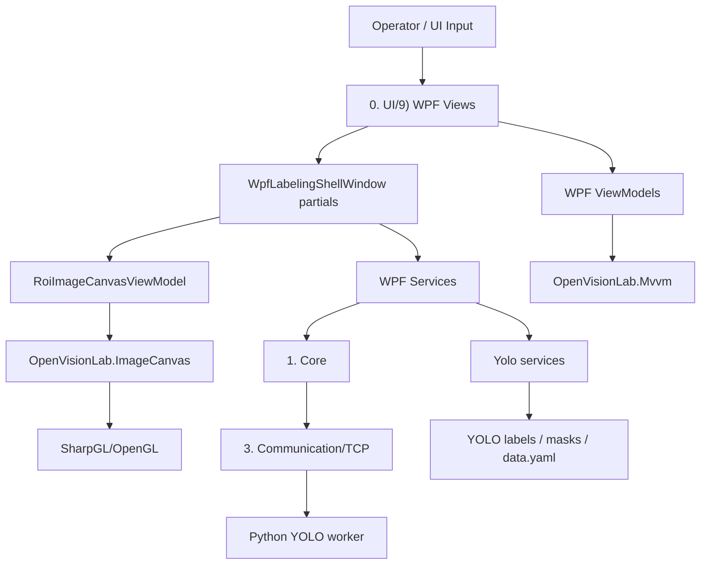

# Code Structure

이 문서는 `OpenVisionLab Labeling Studio` 코드베이스의 상위 수준 구조를 빠르게 파악하기 위한 안내서입니다. 세부 구현 이력은 `docs/WPF_VIEW_MIGRATION.md`, 작업 복구 맥락은 `CODEX_RECOVERY.md`, 실행/빌드/테스트 명령은 `README.md`를 함께 봅니다.

## 목적

이 애플리케이션은 WPF 기반 라벨링 워크벤치입니다. 사용자는 이미지 큐에서 이미지를 고르고, OpenGL 캔버스 위에서 ROI/세그먼트 라벨을 만들고, YOLO 추론 후보를 검토하고, 학습용 데이터셋을 저장/점검합니다.

현재 구조 전환의 큰 방향은 다음과 같습니다.

- WPF가 메인 셸, 패널, 워크플로우, 명령 바인딩을 소유합니다.
- ViewModel은 화면 상태와 명령 상태를 소유합니다.
- Service는 라벨링 규칙, 데이터셋 저장, 검출 후보 상태, 이미지 로드, 마스크/ROI 연산처럼 테스트 가능한 비주얼 외 로직을 소유합니다.
- OpenVisionLab.ImageCanvas는 고성능 OpenGL 뷰어 경계입니다.
- Python/YOLO는 학습, 추론, weight/runtime을 소유하고 C#은 TCP 프로토콜과 데이터셋/라벨 상태를 관리합니다.

공개 제품명은 `OpenVisionLab Labeling Studio`, 빌드/실행 산출물명은 `OpenVisionLab.LabelingStudio`입니다. 내부 C# 네임스페이스에 남아 있는 `MvcVisionSystem`은 XAML partial class와 레거시 코드 연결 때문에 별도 마이그레이션 대상으로 남겨둔 기술 부채이며, 사용자-facing 제품명으로 쓰지 않습니다.

## 빠른 읽기 순서

처음 구조를 파악할 때는 아래 순서로 읽습니다. 이 순서를 따르면 이미 검증된 성능 경로를 건드리지 않고도 변경 위치를 빠르게 찾을 수 있습니다.

1. `docs/LABELING_PROGRAM_DIRECTION.md`
   - 제품 목적, UI 방향, Python/C# 책임 경계를 확인합니다.
2. `docs/STABLE_VERIFIED_AREAS.md`
   - 이미 검증된 성능/UX 경로와 필수 회귀 테스트를 확인합니다.
3. `docs/OBJECT_DETECTION_MVP_COMPLETION.md`
   - 객체탐지 MVP 완료 기준, 포함/제외 범위, 필수 게이트를 확인합니다.
4. `docs/YOLOV5_TRAINING_RESULT_WORKFLOW.md`, `docs/SEGMENTATION_UX_COMPLETION.md`, `docs/ANOMALY_DETECTION_FLOW.md`
   - 학습/비교, 세그멘테이션, 이상탐지 작업이라면 각 영역의 완료 기준과 제외 범위를 먼저 확인합니다.
5. 이 문서의 `변경 위치 선택 가이드`
   - 실제 수정할 파일군을 고릅니다.
6. 관련 `WpfLabelingShellWindow.<Domain>.cs` partial
   - shell orchestration 흐름만 확인합니다.
7. 관련 ViewModel/Service/Presenter
   - 상태, 표시 문구, selection policy, 저장/검증 로직의 실제 소유자를 확인합니다.

문서나 PowerShell 출력에서 한글이 깨져 보이면 파일을 추측으로 다시 작성하지 말고 `Get-Content -Encoding utf8` 또는 `rg`로 먼저 확인합니다.

## 현재 제품 단계

| 영역 | 현재 판단 | 다음 판단 기준 |
| --- | --- | --- |
| 객체탐지 라벨링 | 실사용 베타 수준. ROI 성능, 저장, Candidate Review, 실제 EXE 랜덤 라벨링이 검증됨. | 객체탐지 MVP 완료 기준을 문서와 smoke gate로 고정. |
| Viewer 성능 | 핵심 병목은 안정화됨. 50만 ROI, 브러시/지우개, 삭제 후 줌, texture pan 경로가 보호 대상. | `STABLE_VERIFIED_AREAS.md`의 focused gate 없이 변경하지 않음. |
| MVVM 구조 | 주요 패널은 View/UserControl/ViewModel/Service로 분리됨. | shell orchestration을 더 줄이되 OpenGL/ImageCanvas는 별도 프로젝트화 전까지 보호. |
| 초보자 UX | Guide, Dataset Dashboard, Candidate Review가 개선됨. | 첫 실행 후 10분 튜토리얼과 객체탐지 MVP 플로우를 실제 EXE 기준으로 더 고정. |
| 세그멘테이션 | 브러시/지우개 기반은 확보됨. | 객체탐지 수준의 저장/검토/학습 UX 검증이 필요. |
| 이상탐지 | 방향성 단계. | 데이터셋 목적, 라벨 타입, 학습/검증 플로우 설계 필요. |

## 최상위 폴더

| 경로 | 역할 |
| --- | --- |
| `Program.cs` | 앱 시작점. 기본적으로 WPF 라벨링 셸을 실행합니다. |
| `OpenVisionLab.LabelingStudio.csproj` | .NET 8 Windows 데스크톱 앱 프로젝트. WPF가 기본이며 일부 OpenGL 호환 경계 때문에 WinForms도 켜져 있습니다. |
| `0. UI/9) WPF` | 현재 메인 WPF UI, ViewModel, UI 전용 service, shell partial 파일. |
| `1. Core` | 전역 데이터, 레시피/프로젝트 설정, display layer 상태, 라벨링/검출 application service. |
| `2. Common` | 공용 유틸리티, 로그/메시지 어댑터 등 앱 공통 기능. |
| `3. Communication/TCP` | Python YOLO worker와 통신하는 TCP listener, 메시지 framing, protocol parsing. |
| `Yolo` | YOLO 클래스/라벨 저장, dataset yaml, split, readiness/validation/statistics, review status. |
| `Library` | 레거시/호환 viewer 계층. `CViewer`는 OpenVisionLab ImageCanvas 기반으로 축소 유지됩니다. |
| `OpenVisionLab/Library` | 내부 복사본 라이브러리. 특히 `OpenVisionLab.ImageCanvas`가 ROI/OpenGL 캔버스 핵심입니다. |
| `tests/LabelingApplication.Tests` | 단위/통합/smoke 회귀 테스트. UI 없이 검증하는 구조 검사가 많습니다. |
| `docs` | 개발 방향, WPF 전환, 검증 체크리스트, 아키텍처 문서. |
| `scripts` | 빌드/게시/첫 실행/YOLO smoke 자동화 스크립트. |
| `config` | runtime path 예제 설정. 개인 설정은 local json으로 분리합니다. |

## 의존 방향

일반적인 의존 방향은 아래처럼 유지합니다.



핵심 원칙은 View가 로직을 직접 소유하지 않는 것입니다. 단, `WpfLabelingShellWindow`는 아직 composition root이자 전환 중인 shell orchestration 지점이므로, partial 파일로 책임을 나누고 service/ViewModel로 계속 빼는 방향입니다.

## WPF UI 구조

`0. UI/9) WPF`는 다음 하위 구조를 갖습니다.

| 경로 | 역할 |
| --- | --- |
| `Views` | XAML/UserControl/Window. 화면 요소와 shell partial orchestration. |
| `ViewModels` | WPF 패널 상태, command state, 표시 텍스트, selected item, enabled state. |
| `Services` | WPF 경계에서 필요한 테스트 가능 로직. presenter, selection, image load, annotation workflow, mask/ROI state 등. |
| `Models` | WPF 전용 표시 모델. 예: image queue row/filter model. |
| `Interop` | 기존 진입점에서 WPF shell을 여는 얇은 bridge. |

### WpfLabelingShellWindow

`WpfLabelingShellWindow.xaml.cs`는 shell의 composition root입니다. 직접 모든 기능을 구현하지 않고, 아래와 같이 partial 파일로 책임을 나눕니다.

| partial 패턴 | 책임 |
| --- | --- |
| `PanelWiring.*` | UserControl DataContext 구성, 이벤트/command wiring. |
| `PanelAccessors` | 패널 ViewModel 접근자. |
| `Shell*` | shell lifecycle, input command, status/log, project setting. |
| `Workflow*` | workflow mode, command state fanout, training guide command. |
| `ImageQueue*` | 이미지 큐 로딩/선택/상태/명령. |
| `Annotation*` | ROI, polygon, brush/eraser, undo/redo, save. |
| `AnnotationMask*` | raster mask brush/eraser preview, commit queue, overlay update. |
| `ObjectReview*` | 현재 수동 ROI/segment/object review. |
| `CandidateReview*` | AI 후보 목록, 비교, 확정/스킵/navigation. |
| `Detection*` | 단일/배치 검출 실행, 결과 적용, smoke 실행. |
| `Yolo*` | Python worker runtime/status/settings/training command. |
| `ProjectConfig*` | recipe/config path, persistence, command. |
| `Training*` | 학습 readiness, progress, history. |

새 기능을 넣을 때는 먼저 이미 같은 도메인 partial이 있는지 확인합니다. 새 도메인이라면 `WpfLabelingShellWindow.<Domain>.cs`를 추가하되, 계산/상태 변환은 가능하면 `Services` 또는 `ViewModels`로 둡니다.

## ViewModel 정책

ViewModel은 가능하면 이름에 `ViewModel`을 명시합니다. UserControl이 자기 ViewModel을 직접 생성하지 않고, shell composition root가 DataContext를 주입합니다. View를 단독 이동/생성해도 ViewModel 생성 실패로 깨지지 않는 방향입니다.

대표 ViewModel:

| 파일 | 역할 |
| --- | --- |
| `WpfLabelingShellViewModels.cs` | shell이 사용하는 panel ViewModel 묶음. |
| `WpfLearningWorkflowPanelViewModel.cs` | dataset purpose, annotation tool palette, tutorial/workflow step 상태. |
| `WpfImageQueuePanelViewModel.cs` | 이미지 큐 필터, 검색, 선택, 버튼 상태. |
| `WpfCanvasPanelViewModel.cs` | 캔버스 상단 상태/워크플로우 표시. |
| `WpfObjectReviewPanelViewModel.cs` | 현재 객체 목록, 선택, class 적용/delete 상태. |
| `WpfCandidateReviewPanelViewModel.cs` | AI 후보 목록, 선택 후보 detail, confirm/skip 상태. |
| `WpfYoloStatusPanelViewModel.cs` | YOLO runtime/settings/command 상태. |
| `WpfProjectConfigPanelViewModel.cs` | recipe/config/manifest path 표시와 선택 상태. |
| `WpfTrainingSettingsPanelViewModel.cs` | 학습 parameter editor 상태. |

MVVM 공용 기반은 `OpenVisionLab/Library/OpenVisionLab.Mvvm`입니다. WPF ViewModel은 `WpfObservableViewModel`을 통해 shared observable/command infrastructure를 사용합니다.

## WPF Services

WPF service는 UI shell에서 뽑아낸 테스트 가능한 정책/계산/상태 변환입니다.

| 그룹 | 대표 파일 | 역할 |
| --- | --- | --- |
| Annotation | `WpfAnnotationHistoryService`, `WpfAnnotationWorkflowService`, `WpfAnnotationToolCapabilityService` | undo/redo snapshot, tool capability, workflow action mapping. |
| Mask | `WpfMaskAnnotationService`, `WpfMaskEditStateService`, `WpfMaskStrokeCommitSession`, `WpfMaskStrokeHistoryDraftService` | brush/eraser CPU mask apply, FBO-preview 정책, stroke buffering, undo delta draft. |
| Object Review | `WpfObjectReviewPresenter`, `WpfObjectReviewEditService`, `WpfObjectReviewSelectionService` | object row text, class/delete plan, selection policy. |
| Candidate Review | `WpfCandidateReviewPresenter`, `WpfCandidateReviewStateService`, `WpfCandidateConfirmationService` | AI 후보 row/detail, review state, confirm/skip 정책. |
| Image Queue | `WpfImageQueueSelectionService`, `WpfImageQueuePresenter`, `WpfImageQueueFilterService`, `WpfImageQueueDetailLoader` | 큐 선택, row 표시, 필터, detail load. |
| Image Loading | `WpfImageDecodeService`, `WpfImageDecodeCacheService`, `WpfImageDecodePreloadService`, `WpfImageLoadDiagnosticsService` | 이미지 decode/cache/preload/diagnostics. |
| Detection/Batch | `WpfDetectionTargetService`, `WpfDetectionResultPresentationService`, `WpfBatchDetectionProgressService`, `WpfDetectionWorkerCompletionWaiter` | 검출 target, result card, batch progress, worker wait. |
| Project/Training | `WpfProjectRecipeService`, `WpfTrainingWeightsService`, `WpfTrainingGuideHistoryService`, `WpfWorkflowCommandStateService` | recipe path, latest weight, training guide history, command availability. |

새 UI 요구사항이 생기면 먼저 Presenter/Selection/State service로 분리할 수 있는지 봅니다. Shell partial에는 “어느 service를 언제 호출할지” 정도만 남기는 것이 목표입니다.

## OpenGL Viewer 경계

고성능 viewer 경계는 `OpenVisionLab/Library/OpenVisionLab.ImageCanvas`입니다.

| 경로 | 역할 |
| --- | --- |
| `Engine/ImageCanvasControl.cs` | SharpGL 기반 OpenGL control. texture, refresh, pan/zoom, overlay drawing의 핵심. |
| `Engine/ImageCanvasControl.ViewState.cs` | zoom/fit/actual size/view state 적용. |
| `ViewModel/RoiImageCanvasViewModel.cs` | WPF shell과 ImageCanvas 사이의 ViewModel bridge. ROI/mask/detection overlay 입력 경로. |
| `ViewModel/RoiImageCanvasViewModel.Refresh.cs` | refresh/debounce/render 요청 경로. |
| `RoiInteraction` | ROI mouse down/move/up/key/cursor 조작 로직. |
| `OpenGL` | OpenGL shape/texture/text drawing helper. |
| `Overlays` | ROI/detection/polygon/mask overlay index/manager. |
| `Canvas`, `Model`, `Compatibility` | canvas DTO, shape model, 호환 API. |

성능상 중요한 규칙:

- MouseMove에서 전체 overlay list를 매번 스캔하지 않습니다.
- ROI hit-test/render는 spatial index와 visible viewport query를 사용합니다.
- Pan/zoom/ROI drag/drawing preview는 가능한 한 cached scene과 live overlay path를 사용합니다.
- Brush/eraser drag는 OpenGL FBO preview를 사용하고, CPU MaskData/history commit은 MouseUp 이후 queue로 처리합니다.
- 단일 ROI 삭제/수정은 해당 overlay만 update/remove하고, 전체 redraw/rebuild를 피합니다.
- 대량 객체 50만 개 테스트는 viewer 구조 회귀를 잡는 기준입니다.

## 라벨링 데이터와 YOLO 계층

`Yolo` 폴더는 라벨 파일과 학습 dataset 상태를 담당합니다.

| 파일 | 역할 |
| --- | --- |
| `ClassCatalogService.cs` | 클래스 추가/삭제/정규화. |
| `YoloAnnotationService.cs` | box 라벨 저장/로드, YOLO txt line 변환. |
| `YoloSegmentationAnnotationService.cs` | polygon/mask segmentation 저장/로드. |
| `YoloDatasetSplitService.cs` | train/valid/test deterministic split. |
| `YoloDatasetValidator.cs` | dataset config/files/statistics 검증. |
| `YoloDatasetReadinessService.cs` | 학습 readiness report 구성. |
| `YoloDatasetDiagnosticsService.cs` | operator-facing 문제/경고 report. |
| `YoloImageReviewStatusService.cs` | 이미지별 후보/확정/실패/스킵/검출없음 상태 저장. |
| `YoloImageLabelStatusService.cs` | 이미지 라벨 개수/status 계산. |
| `CYolov5.cs` | data.yaml 생성과 YOLO path normalization. |

`1. Core`의 `LabelingWorkflowService`, `DetectionResultApplicationService`, `LabelingDatasetManifestService`, `CData`, `LabelingProjectSettings`는 UI와 YOLO/file system 사이의 application state를 묶습니다.

## Python/YOLO Worker 통신

Python worker 통신은 `3. Communication/TCP`가 담당합니다.

- C# 앱이 TCP listener를 열고 Python client process를 시작합니다.
- Python은 detection/training status와 detection result를 JSON envelope로 보냅니다.
- C#은 result를 후보 state와 OpenGL detection overlay로 반영합니다.
- 학습/추론 runtime, weight, GPU 처리는 Python 쪽 책임입니다.

관련 설정은 `LabelingProjectSettings.PythonModel`과 WPF YOLO settings panel에서 관리합니다.

## 주요 워크플로우

### 이미지 선택

1. `WpfImageQueuePanelViewModel`에서 선택이 바뀝니다.
2. `WpfLabelingShellWindow.ImageQueue*` partial이 lightweight load path를 실행합니다.
3. `WpfImageDecodeCacheService`/`WpfImageDecodeService`가 이미지를 준비합니다.
4. `RoiImageCanvasViewModel`이 OpenGL texture를 갱신합니다.
5. queue row status는 필요할 때 background refresh로 갱신합니다.

### ROI 박스 라벨링

1. workflow/tool selection이 `Rectangle` 또는 `Ellipse`로 전환됩니다.
2. `RoiImageCanvasViewModel`이 ROI draw mode로 입력을 받습니다.
3. ImageCanvas ROI interaction이 preview/live overlay를 처리합니다.
4. MouseUp 이후 shell이 manual ROI list와 object review row를 incremental update합니다.
5. 저장 시 `YoloAnnotationService`가 YOLO txt를 씁니다.

### Brush/Eraser 세그먼테이션

1. `WpfMaskEditStateService`가 tool/preview/selection 정책을 제공합니다.
2. MouseMove는 `RoiImageCanvasViewModel`의 OpenGL FBO preview에 stroke center를 전달합니다.
3. `WpfMaskStrokeCommitSession`은 CPU commit에 필요한 center만 누적합니다.
4. MouseUp은 `WpfQueuedMaskStrokeCommit`을 queue에 넣습니다.
5. `WpfMaskAnnotationService`가 CPU MaskData에 paint/erase를 적용합니다.
6. `WpfMaskStrokeHistoryDraftService`가 undo delta snapshot을 만듭니다.
7. changed segment만 object review와 mask overlay에 upsert됩니다.
8. 저장 시 `YoloSegmentationAnnotationService`가 mask/png와 segment/json을 씁니다.

### AI 추론 후보 검토

1. 추론 명령이 `DetectionTargetService`를 통해 현재/선택/배치 target을 정합니다.
2. TCP worker가 Python inference를 실행합니다.
3. `DetectionResultApplicationService`가 result를 후보 state로 변환합니다.
4. `WpfCandidateReviewPresenter`가 후보 row/detail/comparison을 만듭니다.
5. 후보 확정은 `WpfCandidateConfirmationService`를 통해 manual label로 이동합니다.

### 저장/데이터셋 점검/학습

1. 저장은 현재 manual ROI/segment를 YOLO box/segmentation output으로 씁니다.
2. dataset manifest/data.yaml은 project/dataset service가 갱신합니다.
3. readiness는 `YoloDatasetReadinessService`와 `YoloDatasetValidator`가 계산합니다.
4. 학습 시작/중지는 TCP worker command로 Python에 위임합니다.

## 테스트 구조

`tests/LabelingApplication.Tests/Program.cs`는 단일 콘솔 테스트 러너입니다. 일반 실행은 전체 회귀를 돌리고, flag로 집중 smoke를 돌릴 수 있습니다.

대표 명령:

```powershell
dotnet build /nodeReuse:false
dotnet run --no-build --project tests/LabelingApplication.Tests
dotnet run --no-build --project tests/LabelingApplication.Tests -- --wpf-mask-drag-performance
dotnet run --no-build --project tests/LabelingApplication.Tests -- --wpf-mask-dirty-bounds
dotnet run --no-build --project tests/LabelingApplication.Tests -- --exe-mask-tools-smoke
dotnet run --no-build --project tests/LabelingApplication.Tests -- --roi-500k-delete-performance
dotnet run --no-build --project tests/LabelingApplication.Tests -- --texture-pan-performance
```

테스트는 단순 기능 검증뿐 아니라 구조 회귀도 잡습니다. 예를 들어 source assertion으로 다음을 확인합니다.

- ViewModel이 WPF control event args에 직접 의존하지 않는지.
- MouseMove가 OpenGL pixel readback/overlay full scan을 하지 않는지.
- Brush/eraser가 FBO preview와 queued CPU commit 구조를 유지하는지.
- object review delete가 full refresh가 아니라 incremental path를 유지하는지.
- WPF shell partial에 다시 DTO/계산 로직이 과도하게 들어오지 않는지.

## 변경 위치 선택 가이드

| 작업 | 먼저 볼 위치 |
| --- | --- |
| 화면 텍스트/버튼 상태 | `0. UI/9) WPF/ViewModels`, presenter service |
| 새 버튼/명령 연결 | 해당 panel XAML, panel ViewModel, `WpfLabelingShellWindow.*Commands.cs` |
| ROI drawing/hit-test/move/resize 성능 | `OpenVisionLab.ImageCanvas/RoiInteraction`, `Engine/ImageCanvasControl.cs`, `RoiImageCanvasViewModel.cs` |
| Brush/eraser 성능 | `WpfMaskAnnotationService`, `WpfMaskEditStateService`, `RoiImageCanvasViewModel` FBO preview 경로 |
| Undo/redo | `WpfAnnotationHistoryService`, annotation history partial, mask history draft service |
| AI 후보 표시/확정 | `WpfCandidateReview*`, `DetectionResultApplicationService`, `WpfCandidateConfirmationService` |
| 이미지 큐 | `WpfImageQueue*` ViewModel/service/partial |
| YOLO txt/mask 저장 | `YoloAnnotationService`, `YoloSegmentationAnnotationService` |
| Dataset readiness | `YoloDatasetValidator`, `YoloDatasetReadinessService`, `YoloDatasetDiagnosticsService` |
| Python worker | `3. Communication/TCP`, `WpfLabelingShellWindow.Yolo*` |
| 학습 UI/상태 | `WpfTrainingSettingsPanelViewModel`, `Training*` partial/service |

## 리팩토링 규칙

- View/UserControl은 자기 ViewModel을 직접 생성하지 않습니다. shell이 DataContext를 주입합니다.
- code-behind에는 화면 생명주기, composition, event-to-command bridge 정도만 남깁니다.
- 계산, 상태 변환, row text, selection policy는 service/presenter/ViewModel로 이동합니다.
- OpenGL canvas 경계에서는 MouseMove 비용을 항상 의심합니다.
- 대량 객체/고빈도 입력 경로에서는 전체 collection rebuild, full overlay redraw, per-event allocation을 피합니다.
- 저장/검증/학습처럼 시간이 걸릴 수 있는 작업은 UI thread에서 오래 잡지 않습니다.
- 새 구조를 만들면 관련 focused test 또는 source assertion을 추가합니다.
- 실제 UX 성능 이슈는 가능한 경우 EXE smoke로 확인합니다.

## 현재 남은 구조적 과제

- 1순위: 객체탐지 MVP 완료 기준을 더 명확히 고정합니다.
  - 프로젝트/데이터셋 생성, 이미지 큐, 박스 라벨링, 저장, 추론, Candidate Review, 완료 후 다음 이미지 이동이 한 플로우로 설명되고 검증되어야 합니다.
  - 기준 문서는 `docs/OBJECT_DETECTION_MVP_COMPLETION.md`입니다.
  - 관련 검증은 `STABLE_VERIFIED_AREAS.md`의 Object Detection Real-EXE Labeling Loop와 Candidate Review 항목을 우선 봅니다.
- 2순위: `WpfLabelingShellWindow`의 남은 orchestration을 더 작은 service/ViewModel 경계로 줄입니다.
  - 단, 이미 검증된 ROI/brush/delete/texture hot path는 구조 정리 명목으로 다시 쓰지 않습니다.
- 3순위: 실제 YOLOv5 학습/결과 비교 플로우를 사용자 플로우로 정리합니다.
  - 기준 문서는 `docs/YOLOV5_TRAINING_RESULT_WORKFLOW.md`입니다.
  - 현재 smoke와 계약은 있으나, 초보자가 학습 결과를 보고 모델 적용 여부를 판단하는 UX는 더 다듬어야 합니다.
- 4순위: 세그멘테이션 UX를 객체탐지 수준으로 올립니다.
  - 기준 문서는 `docs/SEGMENTATION_UX_COMPLETION.md`입니다.
  - 브러시/지우개 성능 기반은 안정화됐으므로 저장, 재열기, 후보 검토, 학습 준비 UX를 보강합니다.
- 5순위: 이상탐지 플로우를 별도 목적/라벨 타입으로 설계합니다.
  - 기준 문서는 `docs/ANOMALY_DETECTION_FLOW.md`입니다.
  - 객체탐지/세그멘테이션 UI를 억지로 재사용하지 말고 dataset purpose와 학습 설명을 먼저 정의합니다.
- `OpenVisionLab.ImageCanvas`는 성능상 핵심 경계이므로 별도 프로젝트화와 API 문서화가 필요합니다.
- 남은 WinForms 의존성은 OpenGL 호환 경계 안에 제한되어야 합니다.

## 완료 보고 전 확인

구조 변경을 완료했다고 보고하기 전에는 최소한 아래를 확인합니다.

```powershell
dotnet build .\tests\LabelingApplication.Tests\LabelingApplication.Tests.csproj -c Debug /nr:false -m:1 /p:UseSharedCompilation=false
dotnet run --project .\tests\LabelingApplication.Tests\LabelingApplication.Tests.csproj -c Debug --no-build -- --wpf-candidate-review-panel
dotnet run --project .\tests\LabelingApplication.Tests\LabelingApplication.Tests.csproj -c Debug --no-build -- --wpf-current-image-smoke-preserve-labels
git diff --check
```

Viewer 성능, brush/eraser, ROI delete, real-EXE object labeling loop를 건드렸다면 `docs/STABLE_VERIFIED_AREAS.md`에 적힌 focused gate를 우선 적용합니다.
