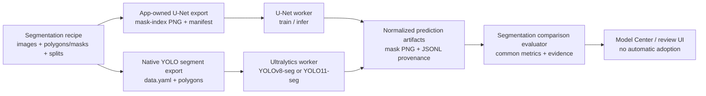

# U-Net 세그멘테이션 어댑터 및 YOLO 비교 설계 (2026-07-21)

Status: Complete

## Scope

이 문서는 OpenVisionLab Labeling Studio에 **U-Net semantic segmentation** 모델 어댑터를 추가하고, 같은 세그멘테이션 레시피에서 YOLOv8-seg 또는 YOLO11-seg와 공정하게 비교하기 위한 구현 계약을 고정한다. 이 문서는 설계만 다루며 코드, 런타임 설치, 모델 학습, 모델 등록 또는 채택은 수행하지 않는다.

현재 제품은 레시피를 이미지 정체성, 클래스, 주석, split, 증거의 기준으로 두고, 각 모델 어댑터가 그 레시피를 자신의 입력 형식으로 변환하는 구조다. 현재 `LabelingDatasetPurpose.Segmentation`, Ultralytics `segment` 학습 경로, 폴리곤/마스크 저장, YOLOv8/YOLO11 세그멘테이션 capability가 이미 있다. 반면 모델 프로필은 YOLOv5/YOLOv8/YOLO11/ONNX만 열거하고, 비교 실행 서비스는 YOLO 런타임을 전제로 한다. 따라서 U-Net은 기존 YOLO 스크립트에 이름만 추가하는 방식이 아니라 명시적인 세그멘테이션 어댑터로 추가한다.

## Product invariant: one recipe, many model formats

`C:\Git`은 모델 실행 환경과 seed weight cache를 두는 위치다. 데이터의 기준 위치가 아니다. 하나의 레시피가 다음의 모델 공통 원본을 소유한다.

- 이미지 identity와 원본 SHA-256
- 클래스 이름·순서·색상으로 구성된 class contract
- 객체 bbox, segmentation polygon/brush mask, 또는 anomaly OK/NG review state
- train/valid/test split과 split fingerprint
- source, export, training, inference, evaluation provenance

각 adapter는 이 공통 원본에서 자기 형식의 **app-owned runtime export**만 만든다. 따라서 동일한 이미지를 `yolov5용 폴더`, `yolov8용 폴더`, `unet용 폴더`에 사용자가 따로 복사·관리하지 않는다.

| 레시피 annotation | 사용할 수 있는 adapter | adapter export |
| --- | --- | --- |
| bbox | YOLOv5/YOLOv8/YOLO11 detection | `data.yaml` + YOLO bbox text |
| polygon 또는 brush mask | YOLOv8/YOLO11 segmentation, U-Net | YOLO segment polygon text 또는 U-Net `mask-index.png` |
| 이미지 단위 OK/NG | anomaly classification | class-folder/manifest 입력 |

U-Net은 bbox만 있는 객체탐지 레시피를 정답 mask 없이 학습하지 않는다. bbox를 사각 mask로 바꾸어 학습하면 사용자가 실제로 라벨링한 결함 형상을 잃으므로 UI가 `세그멘테이션 마스크 필요`로 막는다.

## User-facing outcome

사용자는 세그멘테이션 레시피를 만든 뒤 모델 센터에서 `YOLOv8-seg`, `YOLO11-seg`, `U-Net`을 선택한다. 프로필 선택은 실행 파일·프로젝트·스크립트 경로를 수동으로 바꾸지 않고, 번들 worker와 감지된 Python 환경을 자동 제안한다. 필요한 것은 `연결/설치 필요` 상태로만 명확히 표시하고, 고급 경로는 접은 고급 설정에 둔다.

학습 완료 후 비교 화면은 다음을 분리해 보여준다.

| 영역 | U-Net | YOLO-seg | 비교 방식 |
| --- | --- | --- | --- |
| 공통 품질 | class Dice, mIoU, 픽셀 precision/recall, 픽셀 FP/FN | 동일 | 같은 원본 크기의 GT/prediction mask로 공통 계산 |
| 결함 단위 | 연결 성분 기반 defect TP/FP/FN | prediction mask의 연결 성분 기반 defect TP/FP/FN | 같은 class/IoU/면적 임계값으로 파생 계산, `파생 객체 지표`로 표시 |
| 모델 고유 | loss, checkpoint 크기 | Ultralytics mask/box mAP | 나란히 표시하되 공통 순위 점수에는 혼합하지 않음 |
| 실행성 | warm-up 뒤 median latency, peak VRAM/CPU, 환경 | 동일 | 같은 test 이미지 manifest와 반복 수를 기록 |

`YOLOv5 detection`과 U-Net은 첫 버전에서 직접 비교하지 않는다. YOLOv5의 bbox mAP와 U-Net의 pixel Dice는 같은 과제가 아니기 때문이다. 필요하면 후속 범위에서 이미지 단위 `결함 있음/없음` 민감도만 별도 비교할 수 있으나, 이를 모델 품질 순위로 표시하지 않는다.

## Data contract

### Eligible recipe

1. 목적은 `Segmentation`이다.
2. train/valid/test split이 모두 존재하고, test split은 학습 split과 이미지 SHA-256이 겹치지 않는다.
3. 모든 이미지는 배경 `0`, 클래스 `1..N`을 갖는 단일 채널 `mask-index.png`로 app-owned export가 가능해야 한다.
4. 클래스 순서와 이름은 레시피의 클래스 계약에서만 결정하며, export의 `classes.json` 및 manifest SHA-256에 기록한다.
5. 서로 다른 클래스의 mask가 같은 픽셀을 차지하면 첫 버전에서는 export를 차단하고 충돌 이미지/클래스를 보여준다. 임의 우선순위로 덮어쓰지 않는다.

레시피가 보유한 폴리곤/브러시 마스크는 U-Net export에서 rasterize한다. 외부 native YOLO segmentation `data.yaml`은 후속 adapter 입력으로 허용할 수 있으나, 원본 `data.yaml`과 label은 바꾸지 않고 app-owned raster cache를 만든다. bbox-only YOLO dataset은 U-Net 학습/비교 대상이 아니며 UI가 이유를 표시한다.



### U-Net export artifact

`artifacts/unet-dataset/<dataset-fingerprint>/`에 다음만 생성한다. 레시피 원본 이미지·라벨·`data.yaml`은 변경하지 않는다.

```text
images/train|valid|test/<source-relative-path>
masks/train|valid|test/<source-relative-stem>.png
classes.json
dataset-manifest.json
```

`dataset-manifest.json`에는 source recipe/`data.yaml` path, 원본 tree SHA-256, split별 이미지 SHA-256 목록, 클래스 계약 SHA-256, rasterizer version, mask resolution, 생성 시각을 기록한다. 이미 같은 fingerprint artifact가 있으면 재사용하고, source가 달라지면 새 artifact를 만든다.

## Runtime adapter contract

### Profile, local runtime, and worker

- 새 engine key는 `UNet`이며, supported purpose는 `Segmentation`뿐이다.
- 번들 worker `Runtime/Python/openvisionlab_unet_worker.py`를 추가한다. Ultralytics worker에 U-Net 학습 코드를 섞지 않는다.
- worker는 기존 TCP request/status 형식을 재사용하되 capability에 `trainingModels`, `segmentationModels`와 task 제한을 명확히 반환한다.
- 첫 구현은 이미 사용 중인 PyTorch만 사용한다. `segmentation_models_pytorch` 같은 새 모델 동물원 의존성은 추가하지 않는다.
- 모델은 background 포함 `N+1` channel softmax U-Net이다. loss는 class-balanced cross-entropy + Dice로 고정하고, 입력 크기·normalization·augmentation·seed·device를 checkpoint와 summary에 기록한다.
- checkpoint는 `.pt` 하나에 architecture version, class map, preprocessing, threshold, epoch, best validation metric을 포함한다. 다른 클래스 계약의 checkpoint 로드는 차단한다.

사용자가 모델을 고르면 아래 profile이 자동으로 적용된다. 실행 경로·프로젝트·worker script 입력칸은 고급 설정으로만 남기며, 기본 흐름에서 사용자가 수동으로 바꾸지 않는다.

| 선택 profile | 로컬 runtime | seed weight | 학습 결과 위치 |
| --- | --- | --- | --- |
| YOLOv5 detection | 기존 `C:\Git\yolov5` source + venv | 기존 YOLOv5 weight cache | 레시피의 model artifact/registry |
| YOLOv8-seg | `C:\Git\yolov8` Ultralytics Python | `weights\yolov8n-seg.pt` | 레시피의 model artifact/registry |
| YOLO11-seg | YOLOv8과 동일한 `C:\Git\yolov8` Ultralytics Python | `weights\yolo11n-seg.pt` | 레시피의 model artifact/registry |
| U-Net | 새 `C:\Git\unet` 전용 Python/PyTorch venv | 없음; 첫 학습은 random initialization | 레시피의 model artifact/registry |

YOLO11은 독립 GitHub repository가 아니라 Ultralytics가 제공하는 모델 계열이다. 그러므로 YOLOv8와 Python runtime을 공유하고 model/weight/task만 달라진다. 현재 `C:\Git\yolov8\.venv-gpu`의 Ultralytics `8.4.101` 및 CUDA PyTorch 환경은 YOLO11 model loading capability를 제공한다. 의도한 `YOLO11 준비` 동작에서만 `yolo11n-seg.pt`를 `C:\Git\yolov8\weights`에 cache한다.

U-Net은 원칙적으로 GitHub의 임의 구현을 clone하지 않는다. `C:\Git\unet`에는 app이 준비한 격리 venv, version-pinned PyTorch, worker가 쓰는 model cache/run directory만 둔다. U-Net source는 버전 관리되는 앱의 번들 worker에 남긴다. runtime이 없을 때는 profile 선택만으로 경로 입력을 요구하지 않고, 사용자가 한 번 누르는 `U-Net 런타임 준비` 동작으로 생성·검증한다.

### Inference result

U-Net은 mask probability를 반환한다. 앱 표시를 위해 class별 threshold와 minimum component area로 연결 성분을 만들고, 각 성분을 polygon, bbox, 면적, 평균 probability로 변환한다. 이 값은 YOLO confidence와 같은 의미가 아니므로 UI에는 `마스크 신뢰도`로 표기한다. 기존 candidate-review canvas는 polygon overlay를 재사용한다.

## Normalized comparison contract

각 adapter는 test image마다 다음 artifact를 남긴다.

```text
prediction-manifest.jsonl
predictions/<image-sha256>.png
run-summary.json
```

각 manifest 행에는 image SHA-256, source-relative path, original width/height, class-map SHA-256, prediction mask path/hash, adapter key/version, checkpoint hash, threshold, preprocessing, 실행 시간, device를 기록한다. 비교기는 두 manifest와 GT mask manifest가 다음을 모두 만족할 때만 실행한다.

1. test image SHA-256 목록과 순서가 같다.
2. 클래스 계약 SHA-256이 같다.
3. prediction mask가 original image resolution으로 복원된다.
4. 각 모델의 checkpoint와 source/export fingerprint가 기록되어 있다.
5. 동일한 class/IoU/minimum-area/threshold 정책이 evaluation artifact에 기록되어 있다.

비교 결과는 `artifacts/segmentation-model-comparison/<run-id>/`에 저장한다. report에는 공통 pixel metric, class별 metric, image-level 오류 목록, component TP/FP/FN, latency 반복값, 환경/provenance를 구분한다. `추천`은 품질과 latency의 근거를 설명할 수 있으나 모델 registry 등록·기본 모델 교체·배포를 자동으로 수행하지 않는다.

## UI flow

1. **레시피/데이터셋**: 세그멘테이션 readiness에 mask 충돌, 빈 mask, split 누수, U-Net export 가능 여부를 표시한다.
2. **Model Center**: `U-Net (Segmentation)` 카드를 표시한다. 선택하면 번들 worker와 Python/PyTorch 상태를 자동 점검한다. 연결이 불가능하면 정확한 원인과 한 개의 수정 동작만 보여준다.
3. **학습**: `U-Net 학습 시작`은 eligible export와 runtime capability가 모두 통과해야 활성화된다. 진행률, best Dice, 저장 checkpoint, artifact path를 기록한다.
4. **현재 검사**: overlay는 class별 mask contour와 `마스크 신뢰도`를 표시한다. bbox-only label save나 anomaly OK/NG workflow를 바꾸지 않는다.
5. **비교**: 세그멘테이션 purpose에서만 `U-Net vs YOLO-seg 비교`이 열린다. 비교 시작 전 같은 split/fingerprint를 한 줄로 보여주고, 결과는 공통·파생·고유 지표 섹션으로 나눈다.

## Delivery slices and acceptance evidence

### Slice 1 — canonical mask export and validator

- 레시피 polygon/brush mask를 `mask-index.png`로 materialize하고 source immutability manifest를 만든다.
- overlap, empty positive mask, missing split, class-map mismatch, SHA overlap을 설명 가능한 validation error로 만든다.
- Evidence: focused C# export/validator tests; source before/after tree SHA-256; one known segmentation recipe artifact.

#### Implementation record (2026-07-21)

Status: Complete

- Added `Yolo/UnetSegmentationDatasetExportService.cs`. It reads only the recipe `data/train|valid|test` tree and writes `images`, `masks`, `classes.json`, and `dataset-manifest.json` below `artifacts/unet-dataset/<fingerprint>`.
- The source fingerprint is calculated before and after export. The export is rejected for a non-segmentation recipe, missing split/image, missing positive mask, out-of-contract mask value, missing annotation without an explicit empty label, duplicate image content across splits, invalid segment class contract, or pixels claimed by different classes.
- A matching source/class fingerprint reuses the existing artifact. A mismatching existing artifact is never overwritten.
- Focused test `--unet-segmentation-export` creates train/valid/test recipe data, verifies mask index values, checks before/after source SHA-256 equality, verifies reuse, and proves leakage/class-overlap rejection.

Verification:

```text
dotnet build .\tests\LabelingApplication.Tests\LabelingApplication.Tests.csproj -c Debug /nr:false -m:1 /p:UseSharedCompilation=false /p:OutDir=artifacts\isolated-out\
dotnet .\tests\LabelingApplication.Tests\artifacts\isolated-out\LabelingApplication.Tests.dll --unet-segmentation-export
dotnet .\tests\LabelingApplication.Tests\artifacts\isolated-out\LabelingApplication.Tests.dll --dataset-health
```

Boundary / next dependency: this export is not yet connected to a U-Net Python worker, runtime profile, Model Center control, or YOLO-seg comparison evaluator. Native external YOLO segmentation `data.yaml` raster-cache intake remains a later adapter path; this slice only handles recipe-owned segmentation data.

### Slice 2 — U-Net worker, training, and inference

- `UNet` runtime profile, capability/status, local PyTorch U-Net train/infer, checkpoint compatibility guard를 구현한다.
- Evidence: Python self-test/compile; focused C# runtime contract tests; 1-epoch smoke; restart 후 checkpoint inference; no recipe-source mutation.

### Slice 3 — normalized segmentation evaluator

- U-Net 및 YOLO-seg prediction manifest/mask artifact를 만들고, common pixel/component evaluator를 구현한다.
- Evidence: deterministic fixture에서 expected Dice/mIoU/TP/FP/FN; incompatible split/class-map rejection; provenance report test.

### Slice 4 — Model Center and comparison UX

- 자동 profile selection, readiness/error wording, training/inference/compare command state, history/review panel을 연결한다.
- Evidence: focused ViewModel/service tests, fresh current-build 1920×1080 before/after captures, actual EXE user-path smoke.

### Slice 5 — controlled and real-data evidence

- 동일 세그멘테이션 test split에서 U-Net vs YOLOv8-seg, 선택 시 YOLO11-seg를 같은 epoch/image size/repeat policy로 실행한다.
- Evidence: input/source fingerprints, reproducible run summaries, class/error review, latency repeats. 합성 데이터 결과는 engine benchmark로만 기록한다.
- 독립 실제 카메라·세션 NG mask holdout가 제공될 때만 production-quality/adoption 판단을 별도 수행한다.

## Explicit exclusions

- YOLOv5 bbox mAP와 U-Net Dice를 하나의 점수로 합산하거나 순위를 매기지 않는다.
- 객체탐지 bbox-only, anomaly OK/NG 판정 레시피, instance segmentation의 instance separation은 첫 버전 범위가 아니다.
- 외부 `data.yaml`, 원본 이미지, 원본 label, 기존 YOLO source를 수정하지 않는다.
- 결과가 좋아도 자동 등록, 자동 채택, 기본 모델 교체를 하지 않는다.
- 실제 카메라/별도 세션 holdout 없이 production accuracy라고 주장하지 않는다.

## Decision required before implementation

첫 제어 실행 데이터는 기존 합성 세그멘테이션 레시피를 사용한다. 이는 runtime/format/UX 증거일 뿐 품질 채택 증거가 아니다. 실제 모델 채택 비교는 동일 클래스의 별도 카메라·세션 mask holdout가 필요하다.

Status: Complete
Scope: U-Net semantic-segmentation adapter and YOLO-seg comparison design only.
Acceptance criteria: task/data/metric/provenance/UI boundaries are specified -> satisfied in this document.
Verification: current repository contracts inspected in `LabelingProjectSettings`, `ModelAdapterCatalogService`, `WpfModelComparisonRunService`, and `openvisionlab_ultralytics_worker.py`.
Evidence: this document.
Boundary / next dependency: implementation starts with Slice 1; a real production-quality comparison remains blocked until independent labeled mask data is provided.

#### Slice 2 implementation record (2026-07-21)

Status: Complete

- Added the bundled `Runtime/Python/openvisionlab_unet_worker.py`.  It is a small, app-owned PyTorch U-Net worker; it reuses the existing TCP request/status protocol but accepts only `model: "unet"` and segmentation training/inference requests.
- Added the `UNet` runtime profile to the model settings, connection, support, install-plan, execution-summary, and training workflow services.  Selecting U-Net applies `C:\Git\unet`, its `.venv-gpu\Scripts\python.exe`, and the bundled worker automatically.  It does not make the user choose a project folder or worker script.
- The training workflow exports the canonical recipe through the Slice 1 mask exporter first.  It rejects non-segmentation recipes and external native YOLO `data.yaml` input for U-Net rather than inventing masks from bounding boxes.
- Provisioned the dedicated local runtime at `C:\Git\unet\.venv-gpu` with PyTorch `2.0.1+cu117`, Pillow `12.2.0`, and NumPy `1.25.1`.  The worker supports a new training run (no seed weight), writes `best.pt`/`last.pt`, then loads `best.pt` after a worker restart for inference.
- The first full run exposed a real integration defect: the C# exporter writes `classes.json` with a UTF-8 BOM while Python had opened it as plain UTF-8.  The worker now reads it as `utf-8-sig`; the same exported artifact was used again for the passing CLI and TCP runs.

Verification:

```text
dotnet build .\tests\LabelingApplication.Tests\LabelingApplication.Tests.csproj -c Debug /nr:false -m:1 /p:UseSharedCompilation=false /p:OutDir=artifacts\isolated-out\
C:\Git\unet\.venv-gpu\Scripts\python.exe -m py_compile Runtime\Python\openvisionlab_unet_worker.py
C:\Git\unet\.venv-gpu\Scripts\python.exe Runtime\Python\openvisionlab_unet_worker.py --self-test
dotnet .\tests\LabelingApplication.Tests\artifacts\isolated-out\LabelingApplication.Tests.dll --unet-segmentation-export
dotnet .\tests\LabelingApplication.Tests\artifacts\isolated-out\LabelingApplication.Tests.dll --real-unet-segmentation-runtime --timeout-seconds 90
```

Evidence:

- `artifacts/real-unet-segmentation-runtime-20260721-164530/summary.txt`
  - source SHA before/after: `112C37DC7F27EDBA56FCCA4033884E0C0A884B49EE2DE564215BFAD6B68082DA` (identical)
  - checkpoint: `C:\Git\unet\runs\segment\openvisionlab-unet-smoke-20260721-164530\weights\best.pt`
  - checkpoint SHA-256: `D8BD220F7CF7C0A734E7848A7E7D154DCEDDB549163C74589E221ABC1DD1C4F7`
  - restarted-worker model state: `ready`; inference state: `completed`.

Boundary / next dependency: this proves the U-Net profile, canonical export, real 1-epoch training, source immutability, checkpoint persistence, and restart inference path.  It does not prove useful defect-detection quality: the deterministic one-epoch CPU smoke returned zero components, which is acceptable for a pipeline smoke but cannot be used as a model-quality claim.  Slice 3 must normalize U-Net and YOLO-seg prediction masks/metrics before Model Center can present a valid U-Net-versus-YOLO comparison.

#### Slice 3 implementation record (2026-07-21)

Status: Complete

- Added `Runtime/Python/openvisionlab_segmentation_prediction_export.py`. The selected U-Net or Ultralytics runtime reads only the canonical export's selected split and writes an app-owned `prediction-manifest.jsonl`, indexed prediction PNGs, and `run-summary.json`. It verifies that `classes.json`, the canonical manifest, and the checkpoint class names all agree before prediction.
- Added `SegmentationPredictionExportService`. It resolves the bundled exporter, passes the explicitly selected adapter/runtime/checkpoint, refuses a non-empty output directory, and never asks the exporter to change a recipe image, label, native `data.yaml`, or source model repository.
- Added `SegmentationMaskComparisonService`. It refuses any baseline/candidate record whose dataset fingerprint, recipe-source SHA-256, class-contract SHA-256, split, image SHA-256, image dimensions, or prediction-mask SHA-256 does not match the same canonical export. Only after that guard does it calculate per-class pixel Dice, IoU (the macro average is mIoU), and greedy IoU-matched component TP/FP/FN.
- The comparison output is an app-owned `comparison-summary.json`; no promotion, current-model replacement, or numeric cross-task ranking is performed.

Verification:

```text
C:\Git\unet\.venv-gpu\Scripts\python.exe -m py_compile Runtime\Python\openvisionlab_segmentation_prediction_export.py
C:\Git\unet\.venv-gpu\Scripts\python.exe Runtime\Python\openvisionlab_segmentation_prediction_export.py --self-test
C:\Git\yolov8\.venv-gpu\Scripts\python.exe -m py_compile Runtime\Python\openvisionlab_segmentation_prediction_export.py
dotnet build .\tests\LabelingApplication.Tests\LabelingApplication.Tests.csproj -c Debug /nr:false -m:1 /p:UseSharedCompilation=false /p:OutDir=artifacts\isolated-out\
dotnet .\tests\LabelingApplication.Tests\artifacts\isolated-out\LabelingApplication.Tests.dll --segmentation-mask-comparison
dotnet .\tests\LabelingApplication.Tests\artifacts\isolated-out\LabelingApplication.Tests.dll --real-unet-segmentation-runtime --timeout-seconds 90
dotnet .\tests\LabelingApplication.Tests\artifacts\isolated-out\LabelingApplication.Tests.dll --real-ultralytics-segmentation-prediction-export
```

Evidence:

- `artifacts/real-unet-segmentation-runtime-20260721-173045/summary.txt`: a current U-Net 1-epoch/restart smoke also produced a one-image canonical-test prediction manifest from its generated `best.pt`; its recipe source SHA remained `112C37DC7F27EDBA56FCCA4033884E0C0A884B49EE2DE564215BFAD6B68082DA` before/after.
- `artifacts/real-ultralytics-segmentation-prediction-export-20260721-173053/summary.txt`: the current local YOLOv8 runtime converted an actual two-class segmentation checkpoint into one canonical-test prediction mask/manifest without changing its source image SHA-256.
- `--segmentation-mask-comparison`: an exact baseline mask scores Dice/IoU `1.0`; a deliberately incomplete mask plus a separate false component records lower Dice, false-negative pixels, and one false-positive component. A changed class-contract SHA is rejected before scoring.

Boundary / next dependency: the two real adapter smokes intentionally use different canonical class contracts, so they are evidence that each adapter creates the normalized artifact, not an engine-quality benchmark. A valid U-Net-versus-YOLO number now requires two checkpoints trained for the *same* canonical export/test split. Slice 4 will expose that readiness, launch/export state, and report review in Model Center; Slice 5 is the controlled same-data training/evaluation run.

#### Slice 4 implementation record (2026-07-21)

Status: Complete

- Added the segmentation-only Model Center `U-Net vs YOLO-seg` panel. It shows the common app-owned canonical export/test-mask basis, independently selects the U-Net and YOLOv8-seg/YOLO11-seg checkpoints, and keeps those temporary comparison inputs separate from the saved current inspection model.
- Added `WpfSegmentationAdapterComparisonRunService`. It owns the exact sequence `canonical export -> U-Net raw prediction export -> YOLO raw prediction export -> provenance-guarded comparison`, writes a timestamped artifact below `artifacts/segmentation-adapter-comparison`, and never replaces/adopts a model.
- The current U-Net runtime root is reused when it is valid; otherwise the automatic `C:\Git\unet` profile default is used. This prevents a comparison from silently changing a working local U-Net setup.
- The user-facing metric text states that common raster-mask Dice/IoU/component TP/FP/FN is the comparison basis and that YOLO mAP is not summed or ranked against it. The run command remains disabled until both checkpoint paths exist, while a run is active, or when the recipe is not segmentation.

Verification:

```text
dotnet build .\tests\LabelingApplication.Tests\LabelingApplication.Tests.csproj -c Debug /nr:false -m:1 /p:UseSharedCompilation=false /p:OutDir=artifacts\isolated-out\
dotnet .\tests\LabelingApplication.Tests\artifacts\isolated-out\LabelingApplication.Tests.dll --wpf-segmentation-adapter-comparison
dotnet .\tests\LabelingApplication.Tests\artifacts\isolated-out\LabelingApplication.Tests.dll --wpf-visual-smoke --review-tab training --dataset-purpose segmentation --unet-runtime-ready --screen-capture --output artifacts\ui\unet-yoloseg-comparison-after-20260721.png
```

Evidence: `artifacts/ui/unet-yoloseg-comparison-before-20260721.png` and `artifacts/ui/unet-yoloseg-comparison-after-20260721.png` are the current-source 1920x1080 comparison-panel captures.

Boundary / next dependency: Slice 4 exposes a safe comparison workflow but has no paired score to display until U-Net and YOLO checkpoints share the exact canonical export/class/split contract. Slice 5 must run that controlled same-data benchmark; it remains engine evidence only until an independent camera/session mask holdout is available.
