# OpenVisionLab Labeling Studio 사용 가이드

OpenVisionLab Labeling Studio는 라벨을 몇 개 그려서 끝내는 프로그램이 아닙니다.
이미지 폴더를 열고, 데이터셋을 만들고, 라벨을 저장하고, 학습한 모델로 다시 검사해보는 흐름까지 한 번에 이어지는 작업대입니다.

이 문서는 객체탐지 작업을 기준으로 설명합니다. 세그멘테이션과 이상탐지는 같은 흐름을 쓰지만 라벨 형태와 검증 기준이 다르므로 뒤쪽에서 따로 정리합니다.

화면을 크게 보려면 [labeling-workbench-tutorial.html](labeling-workbench-tutorial.html)을 엽니다.
HTML 파일 하나만 다른 PC에 복사해서 보려면 이미지가 포함된 [labeling-workbench-tutorial-standalone.html](labeling-workbench-tutorial-standalone.html)을 사용합니다.

각 화면에는 번호와 화살표를 넣어, 이미지만 봐도 어디를 눌러야 하는지 알 수 있게 구성했습니다.

## 작업 흐름

처음부터 끝까지는 아래 순서로 보면 됩니다.

```text
1 데이터셋 -> 2 라벨링 -> 3 AI 후보 검토 -> 4 학습/모델 -> 모델 적용 -> 다시 검사
```

| 단계 | 해야 할 일 | 확인할 것 |
| --- | --- | --- |
| 데이터셋 | 새 데이터셋을 만들거나 기존 데이터셋을 엽니다. | 이미지 폴더와 저장 폴더가 서로 맞는지 확인 |
| 클래스 | 검사 기준에 맞는 클래스 이름을 정합니다. | 클래스 순서가 기존 라벨과 맞는지 확인 |
| 라벨링 | 박스, 세그멘테이션, 이상탐지 기준에 맞게 라벨을 만듭니다. | 저장 필요 상태가 남아 있지 않은지 확인 |
| 학습 | 데이터셋 점검 후 모델 학습을 시작합니다. | 경고와 실패 사유를 먼저 확인 |
| 모델 검토 | 학습 결과 모델을 기존 모델과 비교합니다. | 후보 모델과 현재 검사 모델을 구분 |
| AI 후보 검토 | 현재 검사 모델로 후보를 만들고 검토합니다. | 후보를 확정한 뒤 라벨 저장 |

## 먼저 헷갈리는 것

| 화면 표시 | 의미 |
| --- | --- |
| 이미지 폴더 | 원본 이미지가 있는 위치입니다. 라벨 저장 위치가 아닙니다. |
| 저장 폴더 | 라벨, 클래스, `data.yaml`, 학습 분할 파일이 저장되는 위치입니다. |
| 저장 라벨 | 사람이 만들었거나 확정해서 저장한 실제 정답 데이터입니다. |
| AI 후보 | 모델이 제안한 결과입니다. 확정 전까지 정답 라벨이 아닙니다. |
| 학습 모델 후보 | 학습은 끝났지만 아직 검사 모델로 선택하지 않은 모델입니다. |
| 현재 검사 모델 | 지금 `현재 검사` 버튼이 사용하는 모델입니다. |

새 데이터셋인데 이전 라벨이 보인다면 대부분 저장 폴더가 같습니다.
이미지 폴더만 바꾸면 새 실험이 되지 않습니다. 새 실험은 저장 폴더도 새로 잡아야 합니다.

## 1. 전체 화면 보기

처음 화면은 네 영역으로 보면 됩니다.

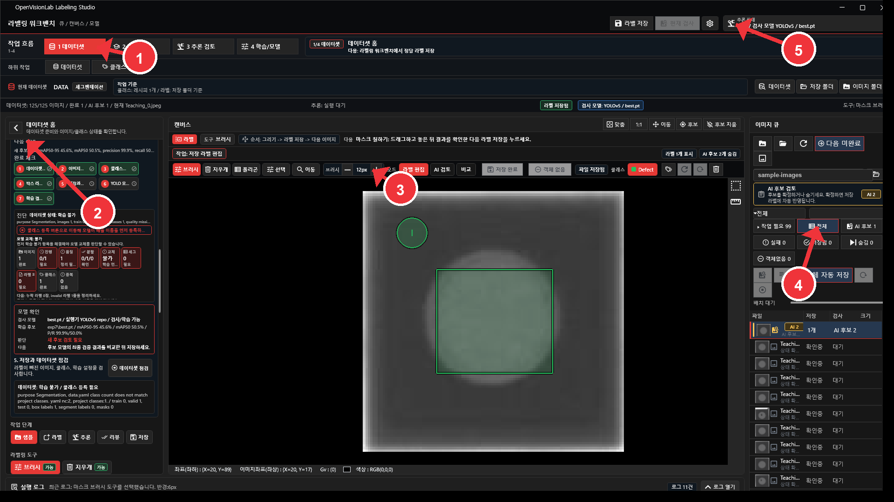

| 번호 | 위치 | 역할 |
| --- | --- | --- |
| 1 | 작업 단계 | 데이터셋, 라벨링, AI 후보 검토, 학습/모델 이동 |
| 2 | 작업 패널 | 현재 단계에서 필요한 설정과 검토 |
| 3 | 캔버스 | 라벨과 후보 위치 확인 |
| 4 | 이미지 큐 | 이미지별 저장 상태, 후보 상태, 실패 상태 확인 |
| 5 | 검사 모델 | 지금 검사에 쓰는 모델 확인 |

화면이 복잡해 보이면 먼저 상단 작업 단계와 오른쪽 이미지 큐를 봅니다.
왼쪽 작업 패널은 현재 단계에서 해야 할 일만 보여주는 영역입니다.

## 2. 데이터셋 만들기

처음에는 데이터셋부터 정합니다.

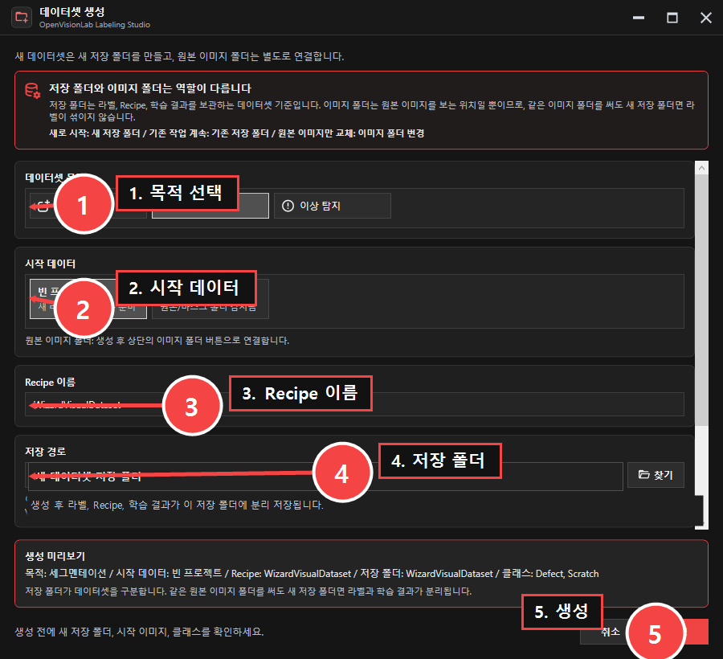

작업 순서:

1. 상단에서 `1 데이터셋`을 선택합니다.
2. 새 데이터셋을 만들거나 기존 데이터셋을 엽니다.
3. 목적을 선택합니다.
4. 원본 이미지 폴더를 지정합니다.
5. 저장 폴더를 확인합니다.
6. 데이터셋 이름, 목적, 클래스 기준이 맞으면 다음 단계로 이동합니다.

목적 선택 기준:

| 목적 | 언제 선택하는지 |
| --- | --- |
| 객체탐지 | 대상 위치를 박스로 잡아야 할 때 |
| 세그멘테이션 | 대상의 모양을 mask나 polygon으로 더 정확하게 따야 할 때 |
| 이상탐지 | 이미지 단위로 정상/불량을 먼저 나누는 작업일 때 |

저장 폴더는 꼭 확인해야 합니다.
데이터셋 이름은 달라도 저장 폴더가 같으면 이전 라벨을 그대로 읽습니다.

## 3. 클래스 등록

라벨을 그리기 전에 클래스를 먼저 정합니다.

예:

```text
OK
NG
Scratch
Missing
Contamination
```

객체탐지에서는 클래스 순서가 YOLO txt의 class index가 됩니다.
이미 학습을 시작한 데이터셋에서는 클래스 이름과 순서를 쉽게 바꾸지 않는 편이 안전합니다.

작업 기준:

- 실제 검사 기준과 같은 이름을 씁니다.
- 정상/불량 기준이 섞이지 않게 정리합니다.
- 클래스가 바뀌면 기존 라벨 파일과 맞는지 확인합니다.
- 저장 폴더가 현재 작업 데이터셋과 맞는지 확인합니다.

## 4. 이미지 큐에서 작업 이미지 고르기

오른쪽 이미지 큐는 파일 목록이면서 작업 현황판입니다.


자주 보는 필터:

| 필터 | 사용 시점 |
| --- | --- |
| 전체 | 작업 전체를 볼 때 |
| AI후보 | 추론 후 후보가 있는 이미지만 볼 때 |
| 실패 | 저장이나 검사 실패 이미지를 다시 확인할 때 |
| 저장됨 | 라벨 저장이 끝난 이미지를 볼 때 |
| 객체없음 | 대상이 없는 이미지로 처리한 항목을 볼 때 |

`다음 미완료`는 아직 저장하거나 검토해야 하는 이미지로 이동합니다.
현재 이미지에 `저장 필요`가 보이면 아직 파일에 반영되지 않은 상태입니다.

## 5. 박스 라벨 그리기

객체탐지에서 가장 기본이 되는 작업입니다.

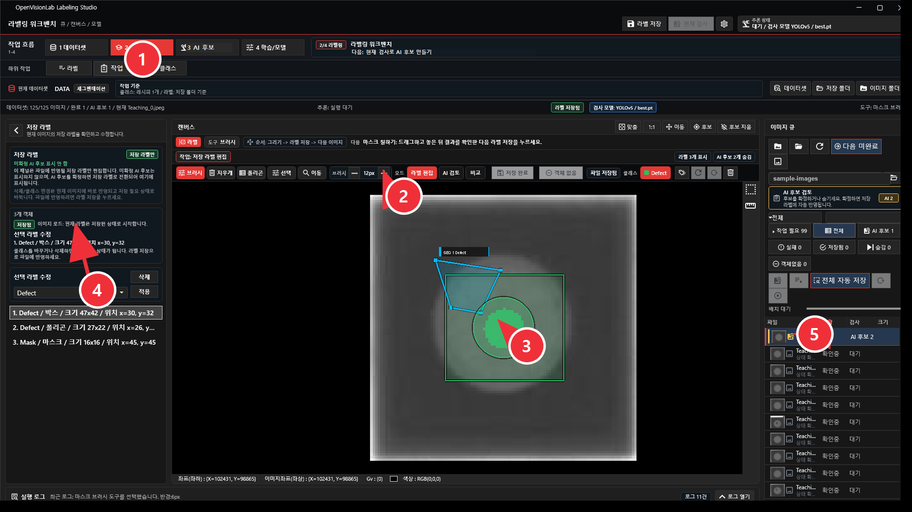

작업 순서:

1. 상단에서 `2 라벨링`을 선택합니다. 기본 화면은 왼쪽 작업 패널을 접고 캔버스와 이미지 큐를 먼저 보여줍니다.
2. 저장 라벨 목록, 현재 작업, 클래스 정보를 넓게 확인해야 하면 왼쪽 레일의 해당 버튼(`열기`, `라벨`, `작업`, `클래스`)을 누릅니다.
3. 툴바에서 `박스`를 선택합니다.
4. 캔버스에서 대상 영역을 드래그합니다.
5. 캔버스와 작업 패널에서 클래스와 크기를 확인합니다.
6. 클래스가 틀리면 바꾸고 `적용`을 누릅니다.
7. `라벨 저장`을 누릅니다.
8. 오른쪽 이미지 큐가 `저장됨`으로 바뀌었는지 확인합니다.

라벨 기준은 작업 중간에 계속 바꾸면 안 됩니다.
대상 전체가 들어가되 배경이 너무 많이 들어가지 않게 잡고, 모든 이미지에 같은 기준을 적용합니다.

## 6. 저장 라벨과 AI 후보 구분하기

이 프로그램에서 가장 중요하게 나눈 부분입니다.

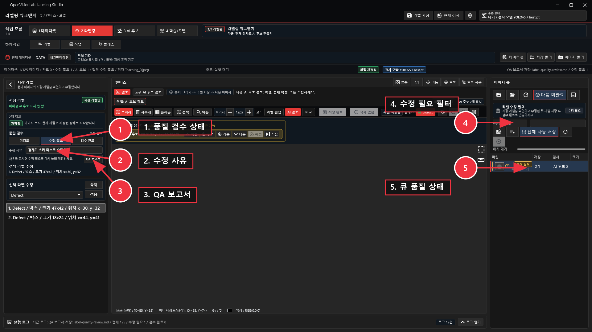

저장 라벨은 학습 데이터입니다.
AI 후보는 모델이 제안한 결과입니다.

둘을 한 화면에서 같이 볼 수는 있지만, 같은 의미가 아닙니다.

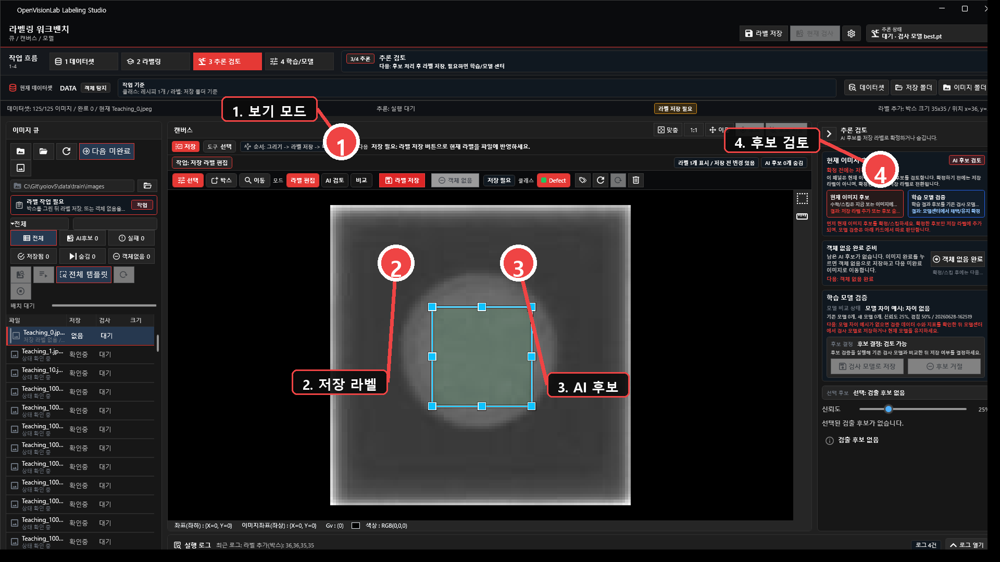

캔버스 보기 모드:

| 보기 | 의미 |
| --- | --- |
| 라벨 | 저장 또는 편집 중인 라벨만 표시 |
| 추론 | AI 후보만 표시 |
| 모두 | 저장 라벨과 AI 후보를 같이 표시 |

작업 기준:

- AI 후보가 맞으면 확정합니다.
- AI 후보가 틀리면 스킵합니다.
- 확정한 후보는 저장 라벨로 넘어갑니다.
- 마지막에는 `라벨 저장`을 눌러 파일에 반영합니다.

## 7. 저장 라벨을 수정한 뒤 다시 저장하기

라벨을 만들거나 고치면 바로 파일에 저장된 것이 아닙니다.

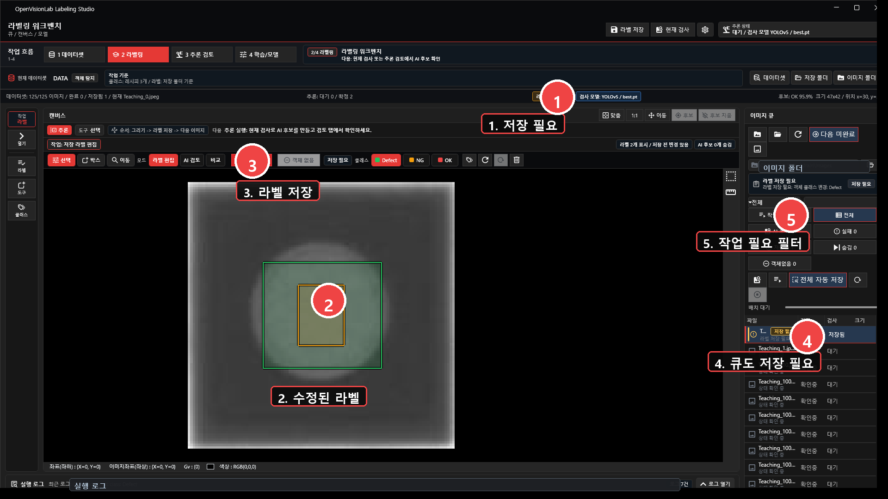

`저장 필요`가 보이면 아직 파일에 쓰지 않은 변경이 있습니다.

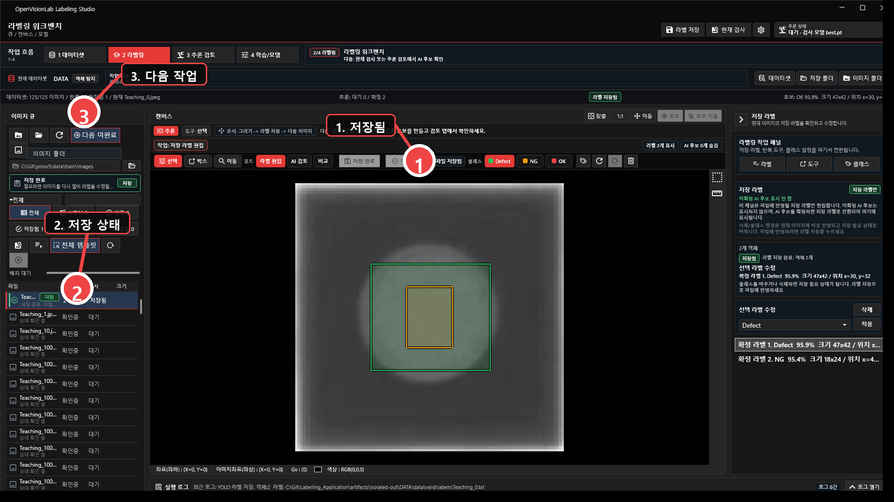

저장 후에는 `저장 필요`가 사라지고 이미지 큐가 `저장됨`으로 바뀌어야 합니다.

## 8. 템플릿으로 반복 라벨링 돕기

템플릿은 학습 기능이 아닙니다.
비슷한 위치에 반복해서 나오는 대상을 빠르게 찾기 위한 보조 도구입니다.

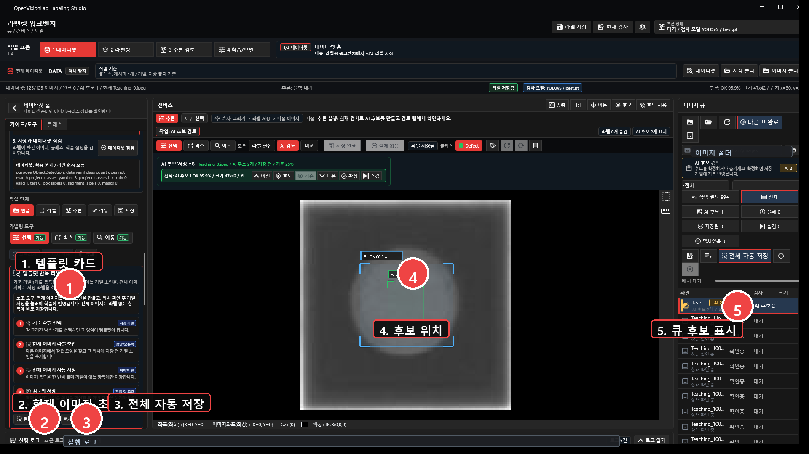

사용 순서:

1. 기준 이미지에서 박스를 그립니다.
2. 그 박스를 저장 라벨로 저장합니다.
3. 현재 이미지 후보로 한 장을 먼저 검증합니다.
4. 괜찮으면 전체 이미지 후보를 실행합니다.
5. 만들어진 후보를 확인하고 맞는 것만 저장합니다.

못 찾는 경우:

- 기준 박스가 배경을 너무 많이 포함했습니다.
- 이미 같은 위치가 저장 라벨로 잡혀 후보에서 제외됐습니다.
- 이미지마다 대상 크기나 밝기가 너무 다릅니다.
- 현재 이미지 한 장 검증 없이 전체 후보부터 실행했습니다.

## 9. 학습 시작 전 데이터셋 점검

학습은 데이터셋 점검을 통과한 뒤 시작합니다.
경고가 있어도 실행은 될 수 있지만, 결과를 믿을 수 있는지는 별도로 판단해야 합니다.

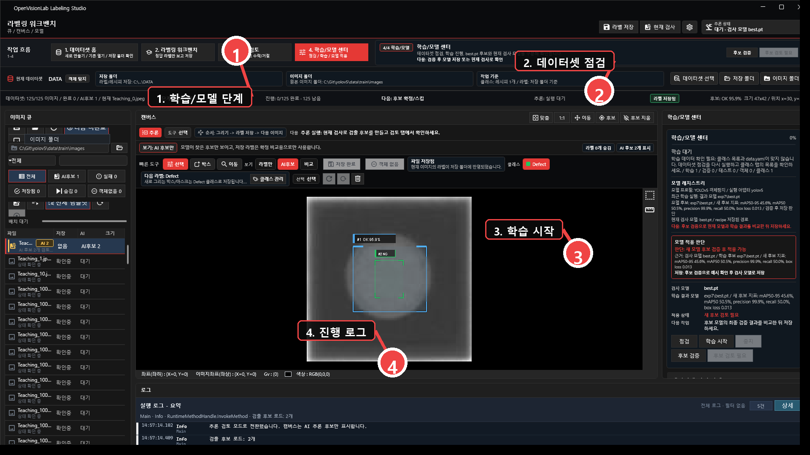

확인할 항목:

- 이미지 수와 라벨 수가 맞는지 봅니다.
- train, valid, test 분할이 있는지 봅니다.
- 클래스별 라벨 수가 너무 치우치지 않았는지 봅니다.
- Python과 모델 실행기 경로가 맞는지 봅니다.
- 학습 중에는 epoch 로그와 실패 사유를 패널에서 확인합니다.

## 10. 학습 완료 후 모델 후보 확인

학습 완료와 검사 모델 적용은 다른 일입니다.
`best.pt`가 만들어졌다는 것만으로 현재 검사 모델이 바뀐 것은 아닙니다.

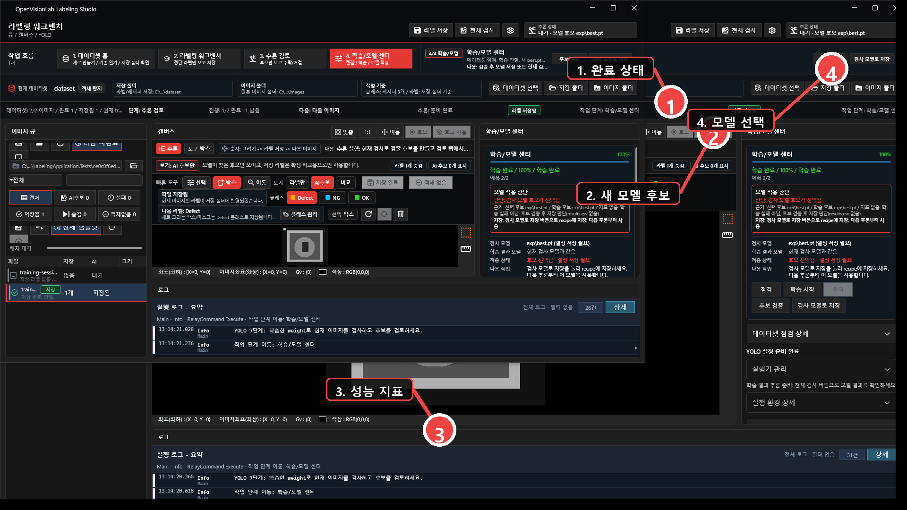

학습 완료 후에는 새 모델이 후보로 등록됩니다.

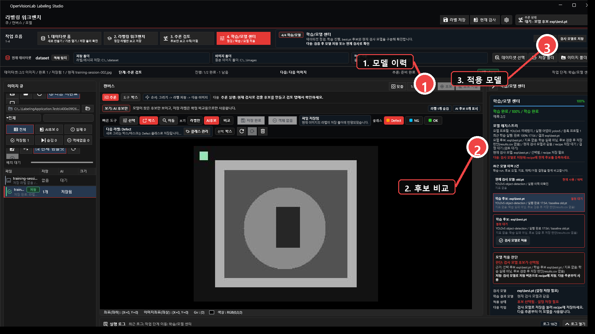

| 상태 | 의미 | 다음 행동 |
| --- | --- | --- |
| 학습 완료 | 학습이 끝나고 weight 파일이 만들어졌습니다. | 후보 검증을 실행합니다. |
| 모델 후보 | 새 weight가 등록됐지만 아직 검사 모델로 확정되지 않았습니다. | 기존 모델과 비교합니다. |
| 현재 검사 모델 | 지금 현재 검사 버튼이 사용하는 모델입니다. | 상단 상태와 모델 센터에서 다시 확인합니다. |

## 11. 현재 검사와 후보 검토

AI 후보 검토는 모델 후보를 그대로 믿는 단계가 아닙니다.
현재 검사 모델로 후보를 만들고, 맞는 후보만 저장 라벨로 넘기는 단계입니다.

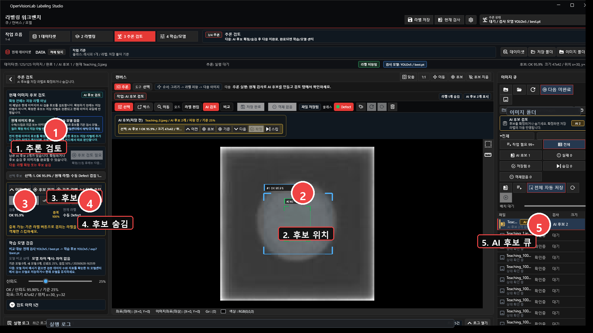

작업 순서:

1. `3 AI 후보 검토`로 이동합니다.
2. `현재 검사`를 실행합니다.
3. 후보가 있으면 위치와 클래스를 봅니다.
4. 맞으면 확정합니다.
5. 틀리면 스킵합니다.
6. 확정된 후보는 저장 라벨이 되므로 마지막에 라벨 저장을 누릅니다.

## 12. 모델 비교와 적용

새 모델이 생겼다고 바로 바꾸지 않습니다.
기존 모델과 비교한 뒤 현재 검사 모델로 저장할지 결정합니다.

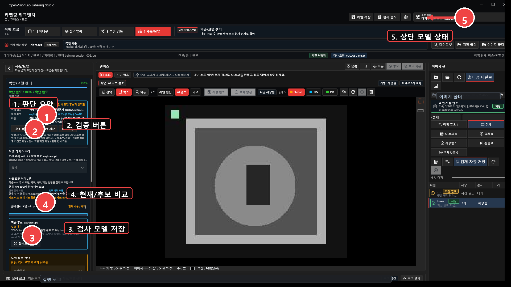

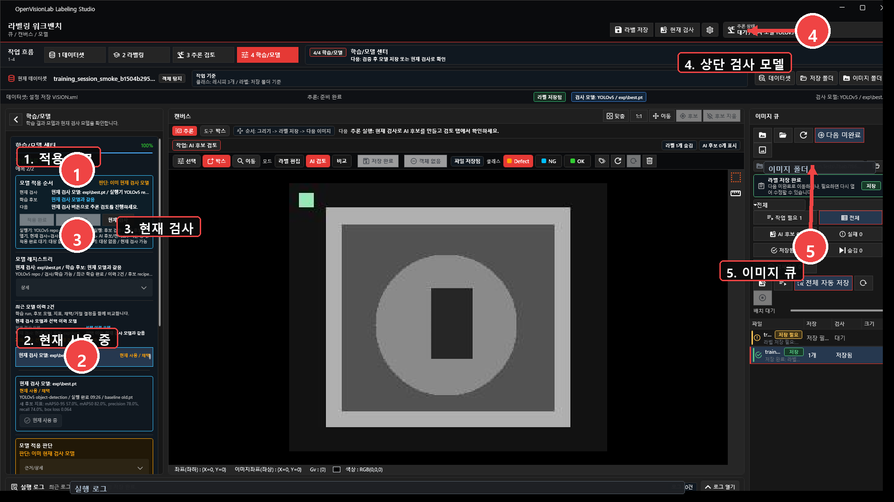

비교 기준:

- 같은 test split으로 비교합니다.
- 같은 클래스 목록과 라벨 기준으로 비교합니다.
- precision, recall, 놓침, 과검출을 같이 봅니다.
- 근거가 부족하면 기존 검사 모델을 유지합니다.
- 적용 후에는 상단 추론 상태와 모델 센터에서 현재 검사 모델이 바뀌었는지 확인합니다.

## 13. 세그멘테이션과 이상탐지

데이터셋, 저장, 학습, 추론 흐름은 유지하되 라벨 형태와 검증 기준은 달라집니다.

세그멘테이션:

- 박스 대신 polygon, brush, eraser로 영역을 만듭니다.
- 라벨 파일 형식이 객체탐지와 다릅니다.
- 브러시와 지우개는 성능 경로가 중요하므로 UI 수정과 별도로 검증합니다.

이상탐지:

- 대부분 이미지 단위 정상/비정상부터 봅니다.
- 결함 위치까지 필요한지 프로젝트 기준을 먼저 정합니다.
- 아직 연결되지 않은 기능은 완료된 기능처럼 표시하지 않습니다.

## 14. 하루 작업 체크리스트

라벨링 시작 전:

- 데이터셋 이름 확인
- 이미지 폴더 확인
- 저장 폴더 확인
- 클래스 목록 확인
- 현재 검사 모델 확인

라벨링 중:

- 저장 필요 상태 확인
- 저장 라벨과 AI 후보 보기 모드 확인
- 클래스 적용 후 라벨 저장
- 실패 이미지 필터 확인

학습 후:

- `best.pt` 후보 등록 확인
- 후보 검증 실행
- 기존 모델과 비교
- 검사 모델로 저장 여부 결정
- 상단 모델 상태 다시 확인
