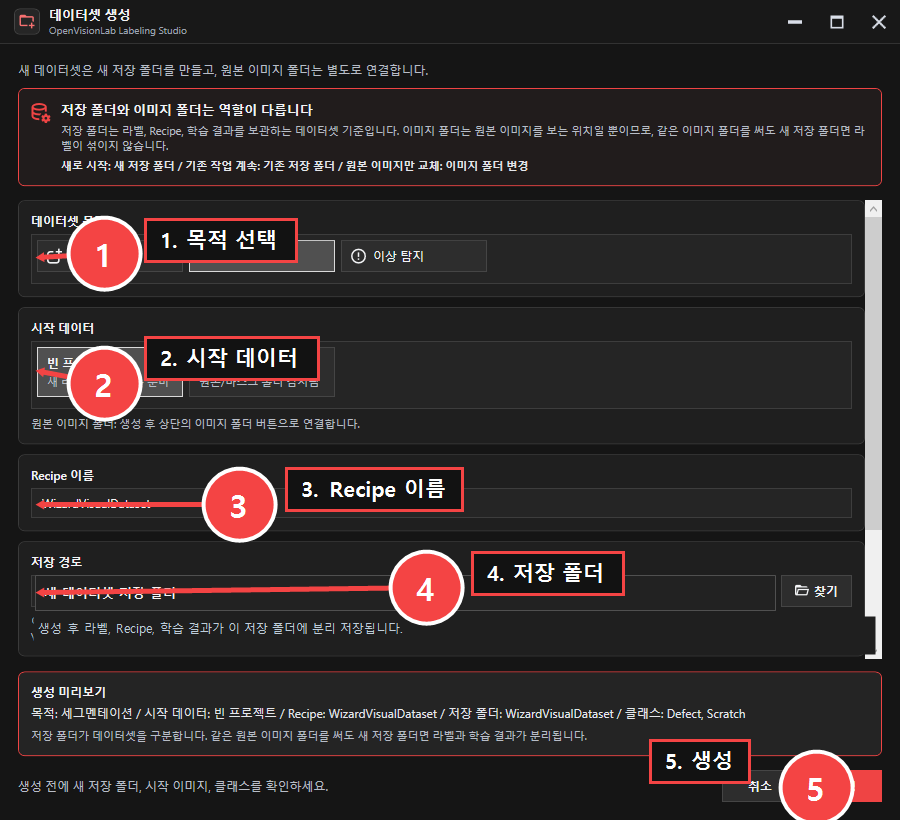

# OpenVisionLab Labeling Studio 사용자 매뉴얼

> 기준 버전: 2026-08-02 현재 제품 흐름
> 대상: 처음 사용하는 작업자부터 학습·검증 담당자까지
> 제품 범위: 로컬 Windows 단일 작업자용 산업 이미지 AI 워크벤치

[웹형 화면 가이드](labeling-workbench-tutorial.html)는 큰 화면과 목차로 보기 좋고,
[단일 파일 가이드](labeling-workbench-tutorial-standalone.html)는 다른 PC로 복사해도
이미지가 함께 열립니다. 이 문서는 기능을 찾고 세부 계약을 확인하는 기준 매뉴얼입니다.

## 1. 가장 빠른 시작: 객체 박스 하나 저장하기

완료 목표는 이미지 한 장에 박스 하나를 그리고, 실제 라벨 파일로 저장하는 것입니다.

준비물:

- 원본 이미지가 들어 있는 폴더
- 라벨과 학습 파일을 기록할 별도 저장 폴더
- 클래스 이름 한 개 이상(예: `Defect`)

작업 순서:

1. `1 데이터셋`에서 `데이터셋 시작`을 누릅니다.
2. 목적을 `객체 탐지`로 선택합니다.
3. 이미지 폴더와 저장 폴더를 각각 지정합니다.
4. `2 라벨링`으로 이동하고 클래스가 없으면 `클래스`에서 추가합니다.
5. 캔버스 왼쪽 도구 레일에서 `박스`를 선택합니다.
6. 객체를 감싸도록 드래그합니다.
7. 클래스와 위치를 확인한 뒤 `라벨 저장`을 누릅니다.
8. 상단과 이미지 큐의 `저장 필요` 표시가 사라지고 `저장됨`이 보이는지 확인합니다.

성공 기준:

- 객체 목록에 박스가 한 개 나타납니다.
- 현재 이미지의 상태가 `저장됨`으로 바뀝니다.
- 다음 이미지로 이동했다가 돌아와도 박스가 다시 보입니다.

오류가 생기면:

- 이전 라벨이 보이면 저장 폴더가 이전 프로젝트와 같은지 확인합니다.
- 박스 도구가 없으면 데이터셋 목적과 현재 작업 단계를 확인합니다.
- 다음 이미지에서 라벨이 사라지면 이동 전에 `라벨 저장`을 눌렀는지 확인합니다.

## 2. 화면을 읽는 법

| 영역 | 역할 | 먼저 확인할 것 |
| --- | --- | --- |
| 상단 단계 | `1 데이터셋 → 2 라벨링 → 3 AI 후보 → 4 학습/모델` 이동 | 현재 강조된 단계 |
| 왼쪽 작업 패널 | 저장 라벨, 현재 작업, 클래스, 모델 후보 검토 | 패널 제목과 선택된 탭 |
| 중앙 캔버스 | 박스·폴리곤·마스크 작성과 비교 | `라벨 편집`, `AI 검토`, `비교` 모드 |
| 캔버스 도구 레일 | 선택, 박스, 브러시, 지우개, 이동, Undo/Redo, 삭제 | 파란색으로 선택된 도구 |
| 오른쪽 이미지 큐 | 파일 이동, 상태 필터, Worklist | 현재 선택 행과 중앙 이미지가 같은지 |
| 상단 상태/저장 | 데이터셋 목적, 저장 상태, 현재 검사 모델 | `저장 필요`, `저장됨`, 모델 이름 |

왼쪽 패널을 펼치거나 접으면 캔버스가 새 영역에 자동으로 맞춰집니다. 보통
`맞춤`을 다시 누를 필요가 없습니다. `맞춤`은 작업자가 임의로 확대·이동한
화면을 원본 맞춤 상태로 되돌릴 때 사용합니다.

현재 제품은 다크 테마만 지원합니다. 테마 선택 메뉴는 표시하지 않으며 내부의
이전 라이트 테마 요청도 다크 팔레트로 돌아옵니다.

## 3. 어떤 라벨링 방식을 선택해야 하나요?

| 작업 목표 | 선택할 목적 | 만드는 정답 | 권장 도구/모델 |
| --- | --- | --- | --- |
| 결함의 대략적인 위치와 개수 | 객체 탐지 | 축 정렬 박스 | 2점 드래그 또는 4점 극점, YOLO detect |
| 결함의 정확한 외곽선·면적 | 세그멘테이션 | 폴리곤 또는 마스크 | 폴리곤, 브러시, Smart Mask, YOLO segment/U-Net |
| 이미지 전체가 정상인지 이상인지 | 이상 탐지 | 이미지 단위 OK/NG | YOLO8/YOLO11 classify |
| 정상 패턴을 학습해 낯선 영역을 찾기 | 이상 탐지 | 정상 학습 세트 + 이미지 판정 + 검토용 위치 근거 | PatchCore |

이상 탐지는 위치를 반드시 라벨링하는 개념이 아닙니다. YOLO 분류는 이미지 전체
OK/NG를 다루고, PatchCore는 이미지 판정과 함께 히트맵·위치 근거를 보여줄 수
있습니다. PatchCore 위치는 검토 자료이며 자동으로 박스나 정답 라벨을 저장하지
않습니다.

## 4. 데이터셋과 Recipe 만들기

목표: 원본 이미지와 라벨 저장 위치, 작업 목적, 클래스 순서를 하나의 Recipe로
확정합니다.

메뉴 위치: `1 데이터셋 → 데이터셋 시작`

1. `객체 탐지`, `세그멘테이션`, `이상 탐지` 중 하나를 선택합니다.
2. 원본 이미지 폴더를 선택합니다.
3. 새 실험이면 비어 있는 별도 저장 폴더를 선택합니다.
4. 클래스 이름과 순서를 확인합니다. 화면의 `0`, `1`, `2` 번호가 학습 class id입니다.
5. 완료 후 첫 이미지, 데이터셋 목적, 이미지 수가 맞는지 확인합니다.

| 항목 | 의미 | 잘못 지정했을 때 |
| --- | --- | --- |
| 이미지 폴더 | 읽을 원본 이미지 위치 | 다른 이미지가 큐에 보임 |
| 저장 폴더 | 라벨, 클래스, 분할, 학습 설정 위치 | 이전 라벨이 다시 보이거나 새 작업과 섞임 |
| 데이터셋 목적 | 도구·저장 형식·학습 흐름 선택 | 필요한 도구나 모델 준비 항목이 맞지 않음 |
| 클래스 순서 | 학습 class id 계약 | 모델 클래스와 라벨 번호가 어긋남 |

완료 신호: 상단에 목적, 이미지 수, 저장 상태가 표시되고 `2 라벨링`으로 이동할 수
있습니다.

## 5. 이미지 큐와 Worklist 사용하기

목표: 모든 파일을 순서대로 훑는 대신 지금 처리할 이미지에 집중합니다.

1. 오른쪽 이미지 큐에서 폴더 열기 또는 새로고침을 사용합니다.
2. `전체`, 저장 상태, 판정 상태, 문제 상태 필터를 조합합니다.
3. `확인 필요 Worklist`를 누르면 미판정, 저장 필요, AI 후보, 검사 실패,
   수정 필요 이미지만 모아 볼 수 있습니다.
4. Worklist에서 현재 작업을 저장하면 다음 확인 필요 이미지로 자동 이동합니다.

성공 기준: 선택 행의 파일명, 중앙 이미지, 상단 현재 이미지 이름이 일치합니다.

오류가 생기면:

- 하위 폴더의 이미지가 먼저 보여도 루트 전체를 한 큐로 읽은 정상 동작일 수 있습니다.
- 이미지가 없으면 폴더 필터와 파일 확장자를 확인합니다.
- 찾던 파일이 사라졌다면 `전체`와 `후보 숨김` 상태를 확인합니다.

## 6. 클래스 만들기와 순서 지키기

메뉴 위치: `2 라벨링 → 왼쪽 작업 패널 → 클래스`

1. 클래스 이름과 색을 추가합니다.
2. 객체를 그리기 전에 활성 클래스를 선택합니다.
3. 라벨링을 시작한 뒤에는 클래스 순서를 임의로 바꾸지 않습니다.
4. 기존 모델을 사용할 때는 모델 클래스 목록과 Recipe 클래스 번호를 대조합니다.

클래스 번호는 화면과 라벨 파일, 학습 모델을 연결하는 계약입니다. 현재 기능은
번호를 명확히 보여주지만 기존 데이터의 재정렬이나 자동 스키마 마이그레이션을
수행하지 않습니다.

## 7. 객체탐지 라벨링

### 7.1 2점 드래그 박스

1. `2 라벨링`으로 이동합니다.
2. 캔버스 왼쪽 도구 레일에서 `박스`를 선택합니다.
3. 객체의 바깥 경계가 들어오도록 드래그합니다.
4. 왼쪽 `저장 라벨`에서 클래스와 크기를 확인합니다.
5. 잘못 그린 박스는 이동·크기 조절·삭제하고, 클래스 변경 후 `적용`을 누릅니다.
6. `라벨 저장`을 누릅니다.

### 7.2 4점 극점 박스

원형·긴 물체처럼 모서리 드래그보다 위·아래·왼쪽·오른쪽 끝을 찾기 쉬울 때
사용합니다.

1. 객체탐지 Recipe의 `라벨링 옵션 → 박스 입력`에서 `4점 극점`을 선택합니다.
2. `위 → 아래 → 왼쪽 → 오른쪽` 순서로 네 점을 누릅니다.
3. 네 번째 점에서 일반 축 정렬 Rectangle 한 개가 만들어지는지 확인합니다.
4. `라벨 저장`을 누릅니다.

`Backspace`는 마지막 입력 점을 취소하고, `Esc` 또는 마우스 오른쪽 버튼은 진행 중인
네 점 입력을 취소합니다. 이 기능은 자유 사각형이나 회전 박스를 만드는 기능이
아닙니다. 설정은 현재 Recipe에 저장되며, 복원만으로 박스가 생성되거나 라벨이
저장되지는 않습니다.

## 8. 세그멘테이션 라벨링

### 8.1 수동 폴리곤·브러시·지우개

1. 데이터셋 목적을 `세그멘테이션`으로 선택합니다.
2. 활성 클래스를 선택합니다.
3. 경계가 분명하면 폴리곤 점을 찍고, 면을 칠해야 하면 브러시를 사용합니다.
4. 잘못 칠한 부분은 지우개로 제거합니다.
5. 객체 목록에서 선택한 세그먼트가 맞는지 확인합니다.
6. `라벨 저장`을 누릅니다.

### 8.2 Smart Mask 자동 윤곽

위 GIF는 최신 Windows EXE를 직접 조작해 녹화한 실제 작업 화면입니다. 박스를
그리면 MobileSAM 후보 생성이 자동으로 시작되고, 후보 검토 패널이 열려도 뷰어의
이미지 위치와 배율은 유지됩니다. GIF는 약 20.8초의 실제 핵심 구간을 3.2배로
재생해 불필요한 대기를 줄였으며 합성 캔버스나 재구성된 라벨을 사용하지 않습니다.

1. 세그멘테이션 Recipe의 `라벨링 옵션`에서 `자동 윤곽`을 켭니다.
2. 결함을 감싸는 사각형을 그립니다.
3. MobileSAM이 만든 외곽선 후보를 확인합니다.
4. 빠진 영역에는 포함점, 잘못 포함된 영역에는 제외점을 한 번에 하나씩 추가합니다.
5. `후보 다시 생성`을 누릅니다.
6. `이전 후보 보기`와 `현재 후보 보기`로 비교합니다.
7. 더 나은 후보를 표시한 상태에서 `확정`하거나, 사용할 수 없으면 `스킵`합니다.

`확정`은 현재 표시 중인 후보를 저장 라벨 흐름으로 넘깁니다. 후보 생성과 비교만으로
정답 파일이 바뀌지 않습니다. 확정 뒤 수동 편집을 했다면 `라벨 저장`을 다시
누릅니다. Recipe를 다시 열면 `자동 윤곽` 선택은 복원되지만 추론·확정·저장을
자동 실행하지 않습니다.

## 9. 이상 탐지 라벨링과 PatchCore

### 9.1 YOLO8/YOLO11 이미지 분류

1. 데이터셋 목적을 `이상 탐지`로 선택합니다.
2. 하위 폴더 이름이 `OK`, `normal`, `NG`, `abnormal`이면 앱의 제안을 확인합니다.
3. 폴더 구조를 신뢰할 수 있을 때만 `폴더명 사용`을 선택합니다.
4. `2 라벨링`에서 이미지를 확인합니다.
5. `정상(OK) → 다음` 또는 `이상(NG) → 다음`을 누릅니다.
6. 잘못 판정했으면 `미판정으로 되돌리기` 후 다시 선택합니다.

폴더명은 제안일 뿐이며 이미 저장한 수동 판정을 덮어쓰지 않습니다.

### 9.2 PatchCore 정상 전용 학습과 위치 근거

사용 조건: 정상 이미지로 정상 패턴을 학습하고, 별도의 정상 검증 데이터로 임계값을
정한 뒤 이상 이미지를 검토합니다.

1. `4 학습/모델 → 모델 설정`에서 PatchCore 프로필을 선택합니다.
2. 검토 완료된 정상 train 이미지와 정상 valid 이미지를 확인합니다.
3. 학습 후 `3 AI 후보 → 현재 검사`를 실행합니다.
4. 이미지 판정, `PatchCore 점수`, 임계값을 함께 확인합니다.
5. 위치 근거가 있으면 `히트맵 보기`를 명시적으로 누릅니다.
6. 히트맵을 닫고 작업자가 OK/NG 판정 또는 후속 라벨링을 결정합니다.

히트맵은 Main Viewer 레이어가 아니며 자동으로 열리지 않습니다. 열기·닫기만으로
라벨 저장, 후보 확정, 후보 숨김, 활성 레이어 변경, 모델 채택이 일어나지 않습니다.
히트맵 파일이 없거나 손상되면 안내를 확인하고 검사를 다시 실행합니다.

## 10. 저장 라벨, AI 후보, 검수 상태

| 상태 | 의미 | 다음 작업 |
| --- | --- | --- |
| `저장 필요` | 편집이 아직 파일에 반영되지 않음 | `라벨 저장` |
| `저장됨` | 현재 정답이 저장 폴더에 기록됨 | 검수 또는 다음 이미지 |
| `저장 라벨` | 학습에 사용할 사람 승인 정답 | 편집·검수 가능 |
| `AI 후보` | 현재 검사 모델의 제안 | 확정·숨김·수정 |
| `미검토` | 라벨 품질을 아직 확인하지 않음 | 검수 수행 |
| `수정 필요` | 오류를 발견해 다시 손봐야 함 | 사유 확인 후 수정 |
| `검수 완료` | 저장된 라벨을 현재 기준으로 승인 | 다음 미검토 이미지 |

AI 후보가 맞으면 `확정`, 맞지 않으면 `스킵` 또는 `후보 숨김`을 사용합니다. 확정은
저장 라벨을 만들 수 있지만, 확정 뒤 라벨을 다시 편집했다면 `라벨 저장`을 눌러야
최신 내용이 기록됩니다. `검수 완료` 뒤 라벨을 편집하면 다시 미검토 상태가 됩니다.

## 11. 객체 검토: 가림, Recipe 태그, 그룹

목표: 형상을 바꾸지 않고 객체 단위 검수 정보를 기록하고 같은 이미지의 관련 객체를
묶습니다.

1. `2 라벨링 → 저장 라벨`에서 객체를 선택합니다.
2. 일부가 가려진 객체면 `가림`을 적용합니다.
3. Recipe에 정의한 태그(예: `검수 필요`, `경계 확인`)를 적용합니다.
4. 태그 또는 가림 필터로 필요한 객체만 확인합니다.
5. 같은 이미지에서 둘 이상의 관련 객체를 선택하고 `그룹 구성`을 누릅니다.
6. 객체 형상 변경과 메타데이터 변경을 확인한 뒤 `라벨 저장`을 누릅니다.

그룹은 형상 병합, 함께 이동, 학습 그룹, 이미지 간 추적 기능이 아닙니다. 객체당 한
그룹만 허용되며, 두 개 미만이 되거나 객체가 삭제되면 고아 그룹이 정리됩니다.
메타데이터도 자동 저장되지 않습니다.

## 12. Dataset Health로 저장 데이터를 점검하기

메뉴 위치: `4 학습/모델 → 데이터 → 데이터셋 상태 분석`

1. `개요`에서 이미지·라벨·문제 수를 봅니다.
2. `분할/라벨`에서 train/valid/test와 라벨 존재 여부를 확인합니다.
3. `시각 QA`에서 클래스, 분할, `문제만` 필터를 조합합니다.
4. 목록의 이미지를 확인하고 필요하면 `편집기에서 열기`로 돌아갑니다.
5. `클래스 분포`에서 심한 불균형을 확인합니다.

이 화면은 읽기 전용입니다. 필터·새로고침·미리보기만으로 라벨, split, 클래스,
Recipe가 바뀌지 않습니다. 목록이 비어 있으면 저장 폴더의 `data.yaml`, 이미지와
라벨 폴더 구조를 먼저 확인합니다. 읽을 수 없는 이미지, 같은 split 안의 동일한
파일명 stem, 이미지 없는 라벨·SEG·마스크, 이미지와 SEG/마스크 크기 불일치는
학습 준비를 차단하므로 문제 목록에서 원본과 저장 구조를 먼저 수정합니다.

## 13. 템플릿, 일괄 작업, 데이터 교환

### 템플릿 라벨링

반복 배치에서 같은 위치의 객체를 빠르게 시작할 때 사용합니다.

1. 대표 이미지의 저장 라벨을 확인합니다.
2. 템플릿으로 등록할 객체를 선택합니다.
3. 적용 범위와 대상 이미지를 미리 확인합니다.
4. 템플릿을 적용한 뒤 각 이미지에서 위치와 형상을 검토합니다.
5. 확정된 수정만 저장합니다.

템플릿 적용은 검수 없는 정답 복사가 아닙니다. 카메라 위치나 제품 배치가 달라지면
각 이미지에서 수정해야 합니다.

### 일괄 검사와 데이터 교환

- 일괄 검사는 실행 전 모델·입력·출력 조건을 미리 확인합니다.
- Label Studio, CVAT, COCO, Pascal VOC, YOLO 교환은 변환 미리보기와 건너뛴
  항목 수를 확인한 뒤 적용합니다.
- 가져오기 `적용`은 별도 준비 영역에서 전체 변환이 끝난 뒤 현재 데이터셋에
  반영됩니다. 건너뛴 항목이나 적용 실패가 있으면 기존 파일과 클래스 목록은
  유지되므로, 오류를 해결한 뒤 다시 미리보기와 적용을 실행합니다.
- 회전 박스처럼 지원하지 않는 기하 정보는 축 정렬 박스로 몰래 변환하지 않고
  건너뛰거나 적용을 차단합니다.

## 14. 학습 준비, 실행기, 모델 비교

### 14.1 학습 전 점검

1. `4 학습/모델 → 데이터`에서 이미지 수, 라벨 수, 클래스 분포, split을 확인합니다.
2. Dataset Health 문제를 확인합니다.
3. `학습/비교`에서 목적에 맞는 프로필을 선택합니다.
4. 첫 실행은 `빠른 추천 적용`으로 시작하고 입력 크기·epoch·가중치를 확인합니다.
5. 실행기 self-test가 통과하는지 확인합니다.

| 목적 | 지원 흐름 |
| --- | --- |
| 객체 탐지 | YOLOv5, YOLOv8, YOLO11 detect |
| 세그멘테이션 | YOLOv8/YOLO11 segment, U-Net |
| 이상 탐지 | YOLO8/YOLO11 classify, PatchCore normal-only |

모델 프로필을 선택하면 등록된 실행기의 Python, 프로젝트, 실행 스크립트가 함께
전환됩니다. 자동 탐색이 실패한 첫 연결에서만 실행기 폴더를 지정합니다.

### 14.2 학습 후 비교와 채택

1. 새 `best.pt`가 `학습 모델 후보`로 등록됐는지 확인합니다.
2. 같은 test split, 클래스, 이미지 크기, 임계값 조건으로 현재 모델과 비교합니다.
3. 탐지는 precision·recall·놓침·과검출, 세그멘테이션은 Dice/IoU와 클래스 오류,
   이상 탐지는 confusion과 독립 test 판정을 봅니다.
4. 조건과 근거가 충분할 때만 `현재 검사 모델`로 명시적으로 채택합니다.

학습 완료와 모델 채택은 서로 다른 작업입니다. `test`가 없는 validation 결과는 개발
참고값이며, 생산 모델 교체 근거에는 독립 평가 데이터가 필요합니다.

## 15. 현재 검사와 AI 후보 검토

1. 상단 또는 모델 센터에서 현재 검사 모델을 확인합니다.
2. `3 AI 후보`에서 `현재 검사`를 실행합니다.
3. 후보 위치·클래스·신뢰도와 현재 저장 라벨을 비교합니다.
4. 맞는 후보만 확정하고, 틀린 후보는 숨기거나 수정합니다.
5. 확정 뒤 추가 편집이 있으면 `라벨 저장`을 누릅니다.

후보를 선택하거나 비교 보기로 바꾸는 것만으로 정답은 바뀌지 않습니다. 모델 비교
결과도 자동으로 현재 검사 모델을 교체하지 않습니다.

## 16. 프로젝트 보관, 복구, 진단

### 16.1 프로젝트 아카이브

메뉴 위치: 상단 `설정/도구 → 프로젝트 이동`

- `프로젝트 아카이브 내보내기`는 저장된 Recipe와 데이터셋을 SHA-256 목록과 함께
  묶습니다.
- 가져오기는 다른 프로젝트를 덮어쓰지 않고 새 위치에 풉니다.
- 가져온 Recipe는 내용을 확인한 뒤 명시적으로 적용합니다.
- 저장되지 않은 편집이 있으면 먼저 저장하거나 취소합니다.

### 16.2 비정상 종료 편집 복구

앱이 저장하지 못한 현재 이미지 편집 초안을 발견하면 `편집 복구` 또는 `초안 폐기`를
선택합니다.

복구 범위는 한 개의 현재 이미지 편집 초안입니다. 복구해도 라벨 파일을 자동 저장하지
않으므로 내용을 확인한 뒤 `라벨 저장`을 누릅니다. AI 후보 확정이나 여러 이미지의
자동 복구 기능은 아닙니다.

### 16.3 환경 점검과 지원 자료

메뉴 위치: 상단 `설정/도구 → 진단/지원`

1. 처음 설치했거나 Windows를 복구한 뒤에는 `환경 설정 센터`를 엽니다.
2. `필수 조치` 항목을 위에서 아래로 확인합니다. 앱 파일/사용자 경로/Main Viewer
   그래픽과 현재 선택된 Python·worker·모델 패키지 상태가 한 목록에 표시됩니다.
   YOLOv5는 폴더만 남아 있어도 준비 완료로 보지 않고 `hubconf.py`, `train.py`,
   `detect.py`, `models/common.py`까지 확인합니다.
3. Python 또는 모델 패키지가 없으면 `모델 실행기 설정`으로 이동해 사용할 전용
   venv의 `Scripts\python.exe`를 연결합니다. 대상 환경과 표시된 설치 명령을 확인한
   뒤에만 설치 버튼을 직접 누릅니다.
4. `다시 점검`을 누릅니다. 이 동작은 설치, 설정 저장, 학습, 추론을 실행하지 않습니다.
5. 이미지 열기 전에 그래픽 기능 실패 메시지가 나오면 지원 GPU 드라이버와 로컬/VM
   콘솔 환경에서 다시 확인합니다.
6. 빠른 제품 점검만 다시 실행하려면 `환경 점검`을 누릅니다.
7. 지원 요청이 필요하면 `지원 자료 만들기`를 명시적으로 실행합니다. 지원 ZIP은
   허용된 진단 정보만 포함하고 민감한 값은 가립니다.

Python 본체, GPU 드라이버, CUDA는 관리자 권한·하드웨어 호환성·재부팅 영향이 있어
자동 설치하지 않습니다. CPU 라벨링은 모델 실행기 없이도 계속할 수 있고, GPU 가속이
필요한 모델 기능을 사용할 때만 해당 선택 항목을 준비합니다.

명령줄의 `--environment-self-test --json`은 WPF를 열거나 라벨을 수정하지 않는 읽기
전용 환경 점검입니다. 일괄 추론·학습·라벨링 명령이 아닙니다.

## 17. 저장과 자동 동작 기준

| 동작 | 자동으로 일어나는 것 | 자동으로 일어나지 않는 것 |
| --- | --- | --- |
| 패널 열기/닫기 | 캔버스 영역 자동 맞춤 | 라벨 저장, 검사 실행 |
| Recipe 옵션 복원 | 옵션 표시와 입력 준비 | 도구 선택, 후보 생성·확정, 저장 |
| Smart Mask 후보 생성 | 검토용 후보 표시 | 정답 파일 변경 |
| AI 후보 선택 | 비교·상세 표시 | 후보 확정, 라벨 저장 |
| PatchCore 히트맵 열기 | 읽기 전용 근거 창 표시 | 레이어 생성, OK/NG 저장, 모델 채택 |
| Dataset Health 필터 | 읽기 전용 목록 변경 | 데이터셋 파일 변경 |
| 편집 복구 | 메모리의 편집 초안 복원 | 라벨 파일 저장 |
| 환경 설정 센터 열기/새로고침 | 앱·경로·뷰어·선택 모델 실행기 읽기 전용 확인 | 패키지/드라이버 설치, 설정 저장, 학습, 추론 |
| 학습 완료 | 후보 가중치 등록 | 현재 검사 모델 교체 |

## 18. 자주 발생하는 문제

| 증상 | 원인 후보 | 해결 순서 |
| --- | --- | --- |
| 이전 라벨이 다시 보임 | 이전 저장 폴더를 재사용 | 상단 저장 폴더 확인 → 새 실험이면 새 저장 폴더 선택 |
| 라벨을 만들었는데 다음 이미지에서 없음 | 저장 전 이동 | 이전 이미지로 돌아가기 → `저장 필요` 확인 → `라벨 저장` |
| 박스/브러시 도구가 보이지 않음 | 목적 또는 단계가 다름 | 데이터셋 목적 확인 → `2 라벨링` 이동 |
| Smart Mask 버튼이 비활성 | 세그멘테이션·이미지·실행기 조건 미충족 | 목적 → 현재 이미지 → 자동 윤곽 → MobileSAM 상태 순서로 확인 |
| Dataset Health가 비어 있음 | 저장 구조 또는 필터 불일치 | `data.yaml`과 저장 폴더 확인 → 필터 `전체` → 새로고침 |
| PatchCore 히트맵을 열 수 없음 | 파일 누락·손상 | 안내 확인 → 현재 검사 다시 실행 → 새 후보 선택 |
| 학습 버튼이 비활성 | 데이터 준비 또는 실행기 실패 | 데이터 탭 오류 → self-test → 모델 프로필 순서로 확인 |
| 학습 후 검사 모델이 그대로임 | 후보와 현재 모델이 분리됨 | 비교 결과 확인 → 명시적으로 현재 검사 모델 채택 |
| 이미지 열기 전 그래픽 오류 | 필수 framebuffer 기능 미지원 | 환경 점검 → GPU 드라이버/실제 콘솔 확인 → 지원 자료 생성 |
| Windows 복구 후 모델 기능이 동작하지 않음 | Python/venv/worker/패키지 경로 누락 | 환경 설정 센터 → 필수 조치 → 모델 실행기 설정 → 다시 점검 |

## 19. 작업 종료 체크리스트

라벨링 종료 전:

- [ ] 이미지 큐의 `저장 필요`가 0인지 확인
- [ ] AI 후보와 저장 라벨을 혼동하지 않았는지 확인
- [ ] 클래스 이름과 번호가 Recipe 기준과 같은지 확인
- [ ] 수정 필요 사유와 검수 완료 상태를 확인

학습 전:

- [ ] Dataset Health의 split·라벨·클래스 분포 확인
- [ ] 학습 프로필과 시작 가중치 확인
- [ ] 실행기 self-test 확인
- [ ] 독립 test 데이터 유무 확인

모델 채택 전:

- [ ] 같은 데이터 버전과 평가 조건으로 비교
- [ ] 놓침과 과검출, 클래스별 오류 확인
- [ ] PatchCore라면 점수·임계값·히트맵을 별도로 확인
- [ ] 현재 검사 모델 변경을 명시적으로 수행

앱 종료 전:

- [ ] `저장 필요`와 미확정 후보 확인
- [ ] 중요한 프로젝트는 아카이브 내보내기
- [ ] 오류가 있었다면 환경 점검과 지원 자료 생성

## 20. 제품 범위와 매뉴얼 유지 기준

현재 제품은 로컬 단일 작업자 흐름을 대상으로 합니다. 계정, 클라우드 협업, 검수자
배정, 비디오 추적, 배포 오케스트레이션, 카메라·PLC 제어는 이 매뉴얼의 지원 범위가
아닙니다.

화면이나 작업 계약이 바뀌면 다음을 함께 갱신합니다.

1. 빠른 시작 절차
2. 기능별 메뉴 위치와 완료 신호
3. 실패·복구 안내
4. 현재 화면 캡처와 대체 텍스트
5. 웹형 가이드와 단일 파일 가이드
6. 문서 링크와 자동 검증
